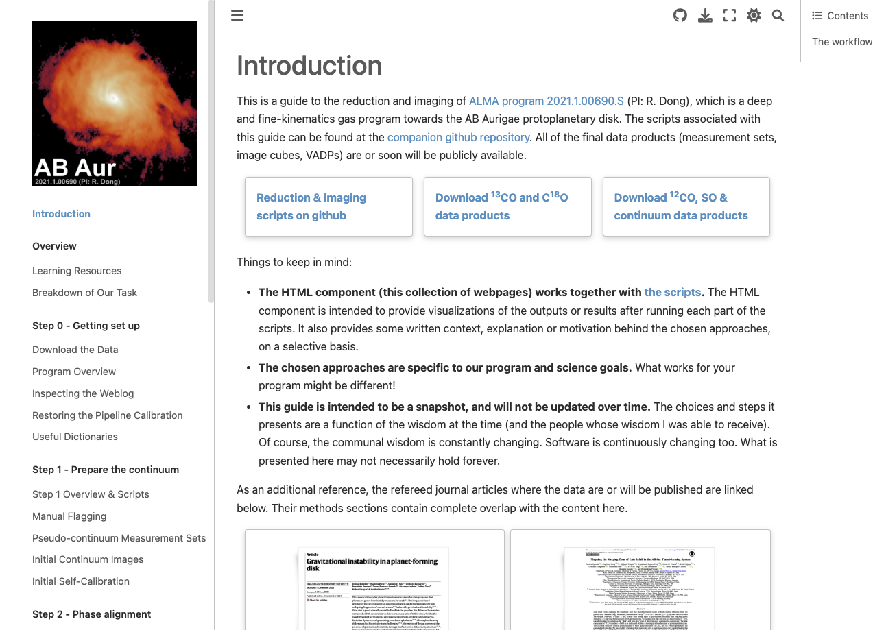

# [Guide to the reduction and imaging of ALMA program 2021.1.00690.S](https://jspeedie.com/guide.2021.1.00690.S/intro.html)

Companion repository with scripts: [https://github.com/jjspeedie/workflow.2021.1.0690.S](https://github.com/jjspeedie/workflow.2021.1.0690.S)

