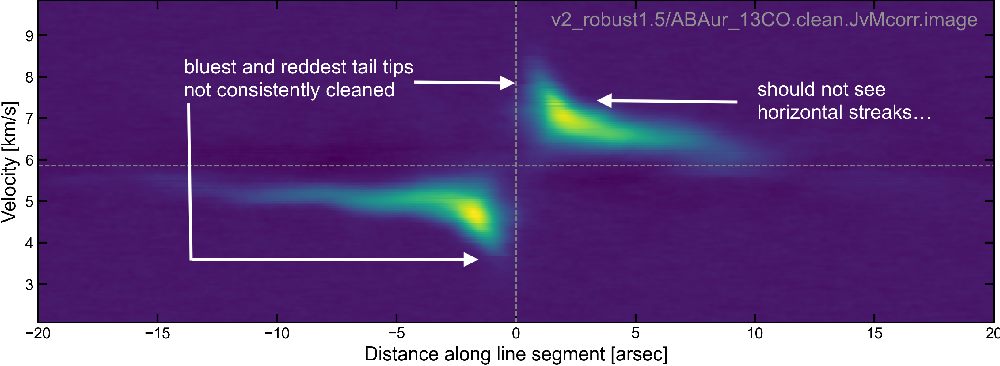
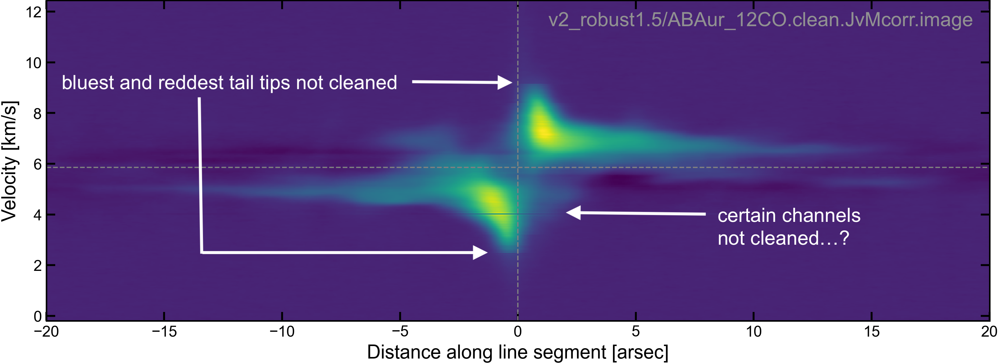
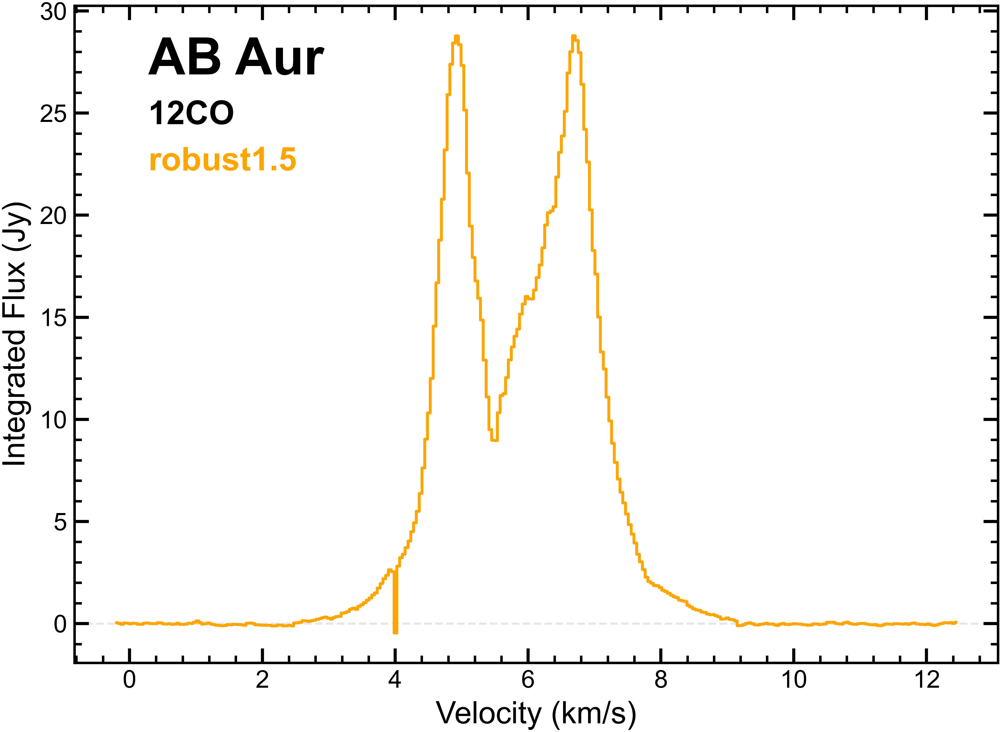
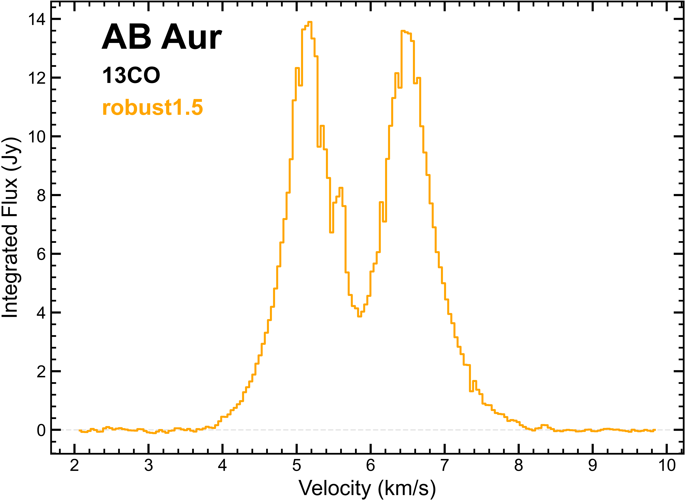

`````{admonition} Scripts for **Imaging - Lines**:
:class: tip
- <a href="https://github.com/jjspeedie/workflow.2021.1.0690.S/blob/main/major_image_lines.py" target="_blank">major_image_lines.py</a> # main script ([adopted approach](imaging-lines-adopted-approach.md))
- <a href="https://github.com/jjspeedie/workflow.2021.1.0690.S/blob/main/image_lines.py" target="_blank">image_lines.py</a> # earlier main script ([initial approaches](imaging-lines-initial-approaches.md))
- <a href="https://github.com/jjspeedie/workflow.2021.1.0690.S/blob/main/dictionary_mask.py" target="_blank">dictionary_mask.py</a> # loads mask_dict
- <a href="https://github.com/jjspeedie/workflow.2021.1.0690.S/blob/main/dictionary_data.py" target="_blank">dictionary_data.py</a> # loads data_dict
- <a href="https://github.com/jjspeedie/workflow.2021.1.0690.S/blob/main/dictionary_disk.py" target="_blank">dictionary_disk.py</a> # loads disk_dict
- <a href="https://github.com/jjspeedie/workflow.2021.1.0690.S/blob/main/JvM_correction_casa6.py" target="_blank">JvM_correction_casa6.py</a> # MAPS JvM correction script ([Czekala et al. 2021](https://ui.adsabs.harvard.edu/abs/2021ApJS..257....2C/abstract))
- <a href="https://github.com/jjspeedie/workflow.2021.1.0690.S/blob/main/keplerian_mask.py" target="_blank">keplerian_mask.py</a> # modified version of [keplerian_mask](https://github.com/richteague/keplerian_mask) by [Rich Teague](https://richteague.github.io/)

````{card} And data (obtained after [step 4](../step4/step4-line-mses-achieved.md)):
- <a href="https://www.canfar.net/storage/vault/list/jspeedie/2021.1.00690.S/private/measurement_sets" target="_blank">ABAur_12CO.bin30s.ms.contsub</a>
- <a href="https://www.canfar.net/storage/vault/list/jspeedie/2021.1.00690.S/private/measurement_sets" target="_blank">ABAur_13CO.bin30s.ms.contsub</a>
- <a href="https://www.canfar.net/storage/vault/list/jspeedie/2021.1.00690.S/private/measurement_sets" target="_blank">ABAur_C18O.bin30s.ms.contsub</a>
- <a href="https://www.canfar.net/storage/vault/list/jspeedie/2021.1.00690.S/private/measurement_sets" target="_blank">ABAur_SO.bin30s.ms.contsub</a>
`````

```{warning}
This page is more of a blog than a guide; more of a journal of experiments. Kept in case some niche aspects can be helpful. Recommend skip to next page: ([adopted approach](imaging-lines-adopted-approach.md).
```

# Initial Approaches

Relevant script: [initial approaches](imaging-lines-initial-approaches.md).
<a href="https://github.com/jjspeedie/workflow.2021.1.0690.S/blob/main/image_lines.py" target="_blank">image_lines.py</a>.

## Cleaning and Masking

The `tclean` task gives the user the option to indicate where in the image to clean. The idea is that, inside the mask, the emission should be real (and therefore included in our model), and outside the mask, any emission should just be noise (and therefore excluded from the model).

For protoplanetary disks, we have some knowledge of how we expect their emission to look throughout the channels, because we expect the bulk of the disk to be Keplerian. [Rich Teague](https://richteague.github.io/) therefore wrote his [keplerian_mask](https://github.com/richteague/keplerian_mask) package, which is widely used for masking when making clean images of disks.

<i>Can we use a keplerian mask for AB Aur?</i> That would be super convenient, but if we look at the [dirty images](imaging-lines-dirty-images.md) of <sup>12</sup>CO, <sup>13</sup>CO, and even C<sup>18</sup>O, the emission is clearly highly non-Keplerian. **We therefore need to explore other options for masking.**

````{card}
<center>
<video width="50%" controls>
  <source src="../_static/videos/ABAur_12CO.clean.keplerian_mask_m4.mov" type="video/mp4" alt="ABAur_12CO.clean.keplerian_mask_m4">
</video>
</center>
+++
`'r_max':10.0` (arcsec), `'dV0':750.0` (large Doppler width of the line, in m/s), `'dVq':0.0` (Doppler width is not a function of radius), `'zr':0.0` (non-elevated emission), `'target_res':None` (scale the CLEAN beam for the convolution kernel).
````

Ryan foresaw this and gave a couple possible ideas:

- Use manually drawn masks. This involves spending (potentially a lot of) time upfront to define the masks by hand, but then you have them and can reuse them continuously. MAPS did this for their 12CO images (Rich Teague took the time to draw the masks for 12CO by hand, and then they used Keplerian masks for everything else). Here's some central channels of Rich's custom CO mask for GM Aur (from this I'm gathering it's hard to draw smooth mask edges):

````{card}
<center>
<video width="50%" controls>
  <source src="../_static/videos/MAPS_CO_custom_mask_GMAur_CO_220GHz.bin_30s.dirty.mask.mp4" type="video/mp4" alt="MAPS_CO_custom_mask_GMAur_CO_220GHz.bin_30s.dirty.mask">
</video>
</center>
+++
MAPS_CO_custom_mask_GMAur_CO_220GHz.bin_30s.dirty.mask ([MAPS](https://alma-maps.info/data.html))
````

- Use a keplerian mask to define a "starting" mask, and then edit it by hand from there. In other words, save time by not drawing a mask from scratch.

- Use auto-multithresh. This works well but is slow. Auto-multithresh is flexible; it draws an initial mask, and then updates it (grows it) during subsequent clean cycles. Here the time investment is re-spent every time you clean.

- Take a dirty image, clean it a little bit, and define a mask by where the emission is over some threshold.

- Bounce back and forth. There's no good recipe that works for everything. Try a couple different things, see what works, and go with that.

What do other people do / can we find examples or guidance in the literature for situations like our own? [Huang et al. (2021, MAPS)](https://ui.adsabs.harvard.edu/abs/2021ApJS..257...19H/abstract) seem to have had a similar issue of non-Keplerian emission with their re-imaging of GM Aur in 12CO, and did something different to the MAPS imaging pipeline. Instead of Rich's custom CO mask, they used "auto-multithresh" to automatically generate masks in tclean on the fly, using some input threshold parameters. The relevant sentences are:

> We applied the multiscale CLEAN algorithm (Cornwell 2008) with scales of [0, 0.4, 1", 2"]. Since 12CO was also reobserved at higher spectral resolution than the other lines, we reimaged 12CO with channel widths of 0.1 km/s for better recovery of the kinematic details. Due to the irregular emission morphology, we used CASA’s auto-multithresh algorithm (Kepley et al. 2020) to draw the CLEAN mask. The auto-multithresh algorithm searches the cube for significant emission, beginning with a relatively conservative mask and then expanding to encompass more emission during subsequent major cycles. The mask was initialized with full coverage of the primary beam from 5.2–6.4 km/s, where the emission is the broadest, because auto-multithresh algorithm does not readily mask diffuse emission. After some experimentation, the following auto-multithresh parameters were selected: sidelobethreshold = 3.0, noisethreshold = 4.0, lownoisethreshold = 1.5, and minbeamfrac = 0.3. The CLEAN threshold was set to 5 mJy, corresponding to ~3× the rms of line-free channels in the dirty image.


## 1st approach: Masking emission with auto-multithresh and the Huang et al. (2021) parameters

The sidelobethreshold and noisethreshold parameters Huang et al. (2021) used are both lower (by 1.0) than the defaults in the "Table of Standard Salues: 12m (long) b75>300m" (specified in the [Automasking Guide](https://casaguides.nrao.edu/index.php/Automasking_Guide)). Effectively, lowering these two parameters makes auto-multithresh "more flexible" (it allows it to grow a little more into lower signal areas than the default values allow).

[Actually, the very first thing I tried was auto-multithresh with the default parameters in the Table of Standard Values. This is how I know the effect of lowering the sidelobethreshold and noisethreshold parameters.]

### Results

I found that even with lowered sidelobethreshold and noisethreshold parameters, auto-multithresh **fails to capture extended/diffuse extended emission** in 12CO and 13CO cubes. We can see this in the movies below. The problem is most clear to see in the rightmost movies, which shows the residuals (what's left after tclean has finished). In all movies, the white contours are the "final" auto-multithresh mask (i.e., the mask used on the last cleaning cycle; all previous cycles' masks would have been less extended, since the mask can only grow between cycles). There are strong residuals *outside the mask*. This means there is emission that is not being included in the model.

````{card}
<center>
<video width="49%" controls>
  <source src="../_static/videos/v1_robust1.5/v1_robust1.5_12CO.check.masking.mp4" type="video/mp4" alt="v1_robust1.5_12CO.check.masking">
</video>
<video width="47%" controls>
  <source src="../_static/videos/v1_robust1.5/v1_robust1.5_12CO.check.masking.residual.mp4" type="video/mp4" alt="v1_robust1.5_12CO.check.masking.residual">
</video>
</center>
+++
12CO: After clean.
````

````{card}
<center>
<video width="49%" controls>
  <source src="../_static/videos/v1_robust1.5/v1_robust1.5_13CO.check.masking.mp4" type="video/mp4" alt="v1_robust1.5_13CO.check.masking">
</video>
<video width="49%" controls>
  <source src="../_static/videos/v1_robust1.5/v1_robust1.5_13CO.check.masking.residual.mp4" type="video/mp4" alt="v1_robust1.5_13CO.check.masking.residual">
</video>
</center>
+++
13CO: After clean.
````

````{card}
<center>
<video width="49%" controls>
  <source src="../_static/videos/v1_robust1.5/v1_robust1.5_C18O.check.masking.mp4" type="video/mp4" alt="v1_robust1.5_C18O.check.masking">
</video>
<video width="49%" controls>
  <source src="../_static/videos/v1_robust1.5/v1_robust1.5_C18O.check.masking.residual.mp4" type="video/mp4" alt="v1_robust1.5_C18O.check.masking.residual">
</video>
</center>
+++
C18O: After clean (The problem is not so bad for C18O.)
````

````{card}
<center>
<video width="47%" controls>
  <source src="../_static/videos/v1_robust1.5/v1_robust1.5_SO.check.masking.mp4" type="video/mp4" alt="v1_robust1.5_SO.check.masking">
</video>
<video width="49%" controls>
  <source src="../_static/videos/v1_robust1.5/v1_robust1.5_SO.check.masking.residual.mp4" type="video/mp4" alt="v1_robust1.5_SO.check.masking.residual">
</video>
</center>
+++
SO: After clean. (Hard to say with SO because we're so close to the noise floor already - perhaps sidelobethreshold and noisethreshold parameters should be raised for SO.)
````

**This is problematic because:**

- If we use JvM-corrected images, the uncaptured emission will be downscaled (by the factor epsilon).

- The cleaning will not actually reach the threshold, meaning the final images will be more shallowly cleaned than we specified. (It's a self-closing loop: tclean/auto-multithresh uses the unmasked regions to estimate the noise left in the residuals, so if it's estimating the noise using the regions with diffuse emission, it will think it's reached the threshold sooner than it has, and therefore stop cleaning, and stop growing the mask.)


## 2nd approach: Masking emission with auto-multithresh and the Huang et al. (2021) parameters, but kickstarting auto-multithresh with a broad mask

Referring back to [Huang et al. (2021, MAPS)](https://ui.adsabs.harvard.edu/abs/2021ApJS..257...19H/abstract), we see they had a solution to the problem of auto-multithresh not masking diffuse emission:

> The mask was initialized with full coverage of the primary beam from 5.2–6.4 km/s, where the emission is the broadest, because auto-multithresh algorithm does not readily mask diffuse emission.

I then discovered that getting auto-multithresh to actually use a pre-defined mask is non-trivial. The [Automasking Guide](https://casaguides.nrao.edu/index.php/Automasking_Guide) provides some information at the bottom of the page, under the section titled *Advanced Use Case - Merging User Masks with Automasking*. So, this seems to be a bit niche, but at least it is a known issue.

Kickstarting auto-multithresh with a broad mask involves:

1. Make the (initial, broad) mask that you want auto-multithresh to start with. (For this I actually took Rich Teague's keplerian mask code and modified it to give me a broad ellipse at all channels within a range I defined. In hindsight there are probably simpler ways to do this, but at the time I had no easier ideas.)

2. Do one initial round of cleaning with the (initial, broad) mask, and without auto-multithresh. For this round I set niter=cycleniter=1 (it's important that niter=cycleniter, and both =1 simply so that the least amount of cleaning happens).

3. Restart tclean, now with auto-multithresh turned on, and give tclean instructions to pick up where the initial clean left off.

For making the (initial, broad) mask, my first approach was to take the sentence "*The mask was initialized with full coverage of the primary beam from 5.2–6.4 km/s, where the emission is the broadest*" to heart, and initialize the broad mask only in the channels where emission is broadest (and have no mask, for this initial round of tclean, in the other channels, trusting that auto-multithresh will make its own). I chose the channel ranges based on where auto-multithresh had started failing to capture the emission in **1st approach**.

### Results

This seems to have worked well. Auto-multithresh did pick up the broad initial mask and take it from there. It won't shrink its mask in subsequent iterations, so we're stuck with the broad mask. But, this approach does seem to capture the diffuse emission in the clean image yield relatively even residuals inside the mask.

````{card}
<center>
<video width="49%" controls>
  <source src="../_static/videos/v2_robust1.5_old/v2_robust1.5_13CO.check.masking.after.entire.clean.mp4" type="video/mp4" alt="v2_robust1.5_13CO.check.masking.after.entire.clean">
</video>
<video width="49%" controls>
  <source src="../_static/videos/v2_robust1.5_old/v2_robust1.5_13CO.check.masking.after.entire.clean.residual.mp4" type="video/mp4" alt="v2_robust1.5_13CO.check.masking.after.entire.clean.residual">
</video>
<video width="49%" controls>
  <source src="../_static/videos/v2_robust1.5_old/v2_robust1.5_13CO.check.masking.after.entire.clean.model.mp4" type="video/mp4" alt="v2_robust1.5_13CO.check.masking.after.entire.clean.model">
</video>
</center>
+++
13CO: After (restarted) clean
````

**Room for improvement:** The broad initial mask should encompass an even larger range of channels. In the residuals movie (middle), there are still some residuals outside the auto-multithresh mask (e.g. 4.8 km/s, 6.942 km/s). If we look at the model (rightmost movie), we can see the multi-scale deconvolver putting many small-Gaussians right up against the edge of the mask, trying to encompass the emission that extends over the sides. This suggests we just need to increase the channel range of the broad initial mask, to include bluer and redder channels.

## 3rd approach: Masking emission with auto-multithresh and the Huang et al. (2021) parameters, but kickstarting auto-multithresh with a broad mask, now over a wider range of channels

Here I did the same thing as **2nd approach**, but initializing the broad mask to begin and end at bluer and redder channels.

### Results

This seems to have not worked as well. The 3 problems I see are:

- The residuals within the mask after cleaning are not of the same magnitude as the "noise" outside the mask. There are significant residuals inside the mask that are spatially uneven. [This can be seen in the residual movies below.]

- The cleaning is uneven in velocity space. Some channels have extremely large residuals in a discontinuous way from other channels. [A good example of this is at 4.002 km/s in 12CO.]

- The tails of 12/13CO emission at the bluest and reddest channels in the clean image stop abruptly, as if they have not been cleaned. [This can be seen in position-velocity maps below as a truncation of the tails in JvM-corrected images. The downscaled-by-epsilon residuals helps to make the problem really visually obvious.]

````{card}
<center>
<video width="49%" controls>
  <source src="../_static/videos/v2_robust1.5/v2_robust1.5_13CO.clean.image.imview_channels.mp4" type="video/mp4" alt="v2_robust1.5_13CO.clean.image.imview_channels">
</video>
<video width="49%" controls>
  <source src="../_static/videos/v2_robust1.5/v2_robust1.5_13CO.clean.residual.imview_channels.mp4" type="video/mp4" alt="v2_robust1.5_13CO.clean.residual.imview_channels">
</video>


</center>
+++
13CO
````

````{card}
<center>
<video width="51%" controls>
  <source src="../_static/videos/v2_robust1.5/v2_robust1.5_12CO.clean.image.imview_channels.mp4" type="video/mp4" alt="v2_robust1.5_12CO.clean.image.imview_channels">
</video>
<video width="47%" controls>
  <source src="../_static/videos/v2_robust1.5/v2_robust1.5_12CO.clean.residual.imview_channels.mp4" type="video/mp4" alt="v2_robust1.5_12CO.clean.residual.imview_channels">
</video>


</center>
+++
13CO
````

Line profiles of the JvM corrected images (another way to see the discontinuous cleaning in the tail channels):

````{card}


+++
caption
````

**Ideas for improvement:** Perhaps one solution is to clean deeper (i.e., lower the threshold at which tclean stops). I have been setting the cleaning threshold to 3x the rms noise measured in line-free channels in the dirty image, and I would not like to deviate from that (3x or 4x the rms is best/common practice).

There are some reasons making me consider abandoning the broad initial mask idea entirely:

1. I'm generally nervous about using a broad mask (especially one that doesn't shrink). If this was a good idea, then no one would bother with developing keplerian masks or the auto-multithresh algorithm. I'm concerned that a broad mask allows artifacts/non-real emission to be cleaned (i.e. to be included in the model). Or, at best, it lets the larger Gaussians bleed into areas of the image that should be blank sky (in other words, the absence/decrease of emission between spiral arms is not respected).

2. Compared to **1st approach** (where auto-multithresh was not initialized with a broad mask), I found that in the **2nd approach** and **3rd approach**, the number of clean major cycles (which I track by asking auto-multithresh to save its intermediate masks) was lower. I'm not entirely sure why, or fully what it means, but I do know it means auto-multithresh has no opportunity to adjust itself.

Thinking back to one of Ryan's ideas: "*Take a dirty image, clean it a little bit, and define a mask by where the emission is over some threshold.*" This seems like a good way that we could develop more precise masks.


## 4th approach: Masking emission with auto-multithresh and the Huang et al. (2021) parameters, but kickstarting auto-multithresh with a mask made from a model

### Making a mask from a clean model

After plotting contours of some of the above cleaned images and imagining how well these contours would serve as an initial mask (read: how the jagged edges might invite tiny Gaussians), I found myself thinking about how I could get a smoother mask. This is how I got the idea of using a clean model to define a threshold mask.

The order of operations now becomes:

1. Make a model. Do this by cleaning down to a threshold of 10x the rms measured in the dirty image in line-free channels (so, not deeply cleaned, to minimize the chances of capturing unreal emission). For this clean, use a primary beam mask (usemask='pb' and pbmask=0.2) in all channels, and no auto-multithresh. Also, remove the smallest multiscale Gaussian so that the model is composed of [0.1, 0.3, 0.6, 1., 2. arcsec] Gaussians.

2. Translate this model into a mask, using a threshold you determine by experimentation. Currently I'm using 10x the mean. For reference, model units are in Jy/pixel.

3. From here, it's the same as before. Do one initial round of cleaning with the (model) mask, and without auto-multithresh. For this round set niter=cycleniter=1 (it's important that niter=cycleniter, and both =1 simply so that the least amount of cleaning happens).

4. Restart tclean, now with auto-multithresh turned on, and give tclean instructions to pick up where the initial clean left off.

Translating a model image into a mask was somewhat non-trivial for me (I didn't find the <a href="https://casadocs.readthedocs.io/en/stable/api/tt/casatasks.imaging.makemask.html?highlight=makemask" target="_blank">makemask</a> and <a href="https://casadocs.readthedocs.io/en/stable/api/tt/casatools.image.html?highlight=calcmask#casatools.image.image.calcmask" target="_blank">ia.calcmask</a> tasks straightforward to use, though examples of them being used in Rich Teague's keplerian mask really helped). Here's an example of how the model mask looks for 13CO, 12CO and C18O (white contours), if the threshold is 10x the mean of the model pixel values, overlaid on top of the model itself. For reference, the rightmost movie shows either the residuals (13CO) or the image (12CO and C18O) from the clean that made the model.

### Imaging with auto-multithresh kickstarted with the mask from a clean model (unedited)


## Pause

# NAASC Virtual Chat with Ryan Loomis (summary)


#
