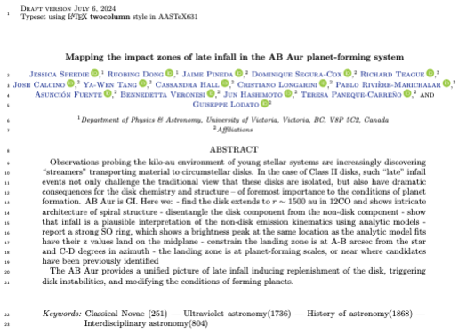
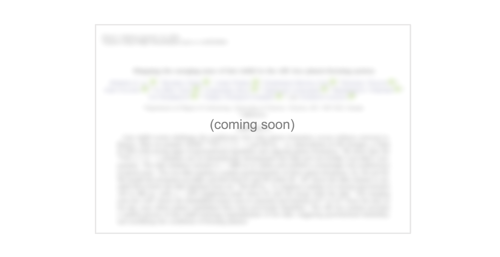

# Now on to the science!

<!-- ## The science we did -->

::::{grid}
:gutter: 2

:::{grid-item-card}

<a href="https://github.com/jjspeedie/workflow.2021.1.0690.S" target="_blank">
  
</a>

<p></p>

<!-- <a href="https://github.com/jjspeedie/workflow.2021.1.0690.S" target="_blank">Speedie et al. 2024</a> presents the program's <sup>13</sup>CO and C<sup>13</sup>O line observations. -->
<sup>13</sup>CO and C<sup>13</sup>O line observations (paper 1).

:::

:::{grid-item-card}

<a href="https://github.com/jjspeedie/workflow.2021.1.0690.S" target="_blank">
  
</a>

<p></p>

<!-- The <sup>12</sup>CO and SO line observations will be presented in <a href="https://github.com/jjspeedie/workflow.2021.1.0690.S" target="_blank">Speedie et al. in prep</a>. -->
<sup>12</sup>CO and SO line observations (paper 2).

:::
::::

<!-- ## The science you could do -->

<div style="background-color:#FAE5D3;">

````{card} Continuum measurement set & images

* **ABAur_continuum.bin30s.ms (524 MB)**

(Available to download soon)

````
</div>

<div style="background-color:#FAE5D3;">

````{card} Line measurement sets & image cubes
Continuum-subtracted spectral line measurement sets:

* **ABAur_12CO.bin30s.ms.contsub (28 GB)**

* **<a href="https://www.canfar.net/storage/vault/list/AstroDataCitationDOI/CISTI.CANFAR/24.0087/data/2021.1.00690.S/measurement_sets" target="_blank">ABAur_13CO.bin30s.ms.contsub (28 GB)</a>**

* **<a href="https://www.canfar.net/storage/vault/list/AstroDataCitationDOI/CISTI.CANFAR/24.0087/data/2021.1.00690.S/measurement_sets" target="_blank">ABAur_C18O.bin30s.ms.contsub (15 GB)</a>**

* **ABAur_SO.bin30s.ms.contsub (15 GB)**

Non-continuum-subtracted spectral line measurement sets:

* **ABAur_12CO.bin30s.ms (28 GB)**

* **<a href="https://www.canfar.net/storage/vault/list/AstroDataCitationDOI/CISTI.CANFAR/24.0087/data/2021.1.00690.S/measurement_sets" target="_blank">ABAur_13CO.bin30s.ms (28 GB)</a>**

* **<a href="https://www.canfar.net/storage/vault/list/AstroDataCitationDOI/CISTI.CANFAR/24.0087/data/2021.1.00690.S/measurement_sets" target="_blank">ABAur_C18O.bin30s.ms (15 GB)</a>**

* **ABAur_SO.bin30s.ms (15 GB)**

The <sup>13</sup>CO and C<sup>18</sup>O data are available to download; the <sup>12</sup>CO and SO will be available soon.
````
</div>
