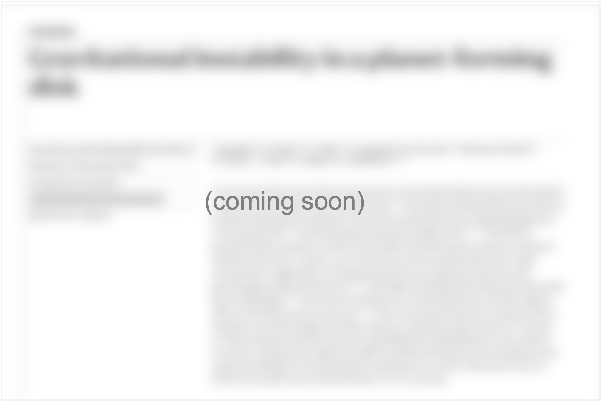

# Now on to the science!

The science we did:

::::{grid}
:gutter: 2

:::{grid-item-card}

<a href="https://github.com/jjspeedie/workflow.2021.1.0690.S" target="_blank">
  
</a>

<p></p>

<!-- <a href="https://github.com/jjspeedie/workflow.2021.1.0690.S" target="_blank">Speedie et al. 2024</a> presents the program's <sup>13</sup>CO and C<sup>13</sup>O line observations. -->
<sup>13</sup>CO and C<sup>13</sup>O line observations (paper 1). Speedie et al. in press.

:::

:::{grid-item-card}

<a href="https://github.com/jjspeedie/workflow.2021.1.0690.S" target="_blank">
  
</a>

<p></p>

<!-- The <sup>12</sup>CO and SO line observations will be presented in <a href="https://github.com/jjspeedie/workflow.2021.1.0690.S" target="_blank">Speedie et al. in prep</a>. -->
<sup>12</sup>CO and SO line observations (paper 2). Speedie et al. in prep.

:::
::::

## Download the data products

What science will you do?


::::{grid}
:gutter: 2


:::{grid-item-card}
<a href="https://doi.org/10.11570/24.0087" target="_blank">**Download <sup>13</sup>CO and C<sup>18</sup>O data products**</a>

`````{dropdown} Full directory structure & file listing

````
./
├── README.md
├── 2021.1.00690.S
│   ├── images_lines
│   │   ├── 13CO
│   │   │   ├── v11_robust0.5
│   │   │   │   ├── ABAur_13CO.clean.JvMcorr.image.fits
│   │   │   │   ├── ABAur_13CO.clean.JvMcorr.image.pbcor.fits
│   │   │   │   ├── ABAur_13CO.clean.image.fits
│   │   │   │   ├── ABAur_13CO.clean.image.pbcor.fits
│   │   │   │   ├── ABAur_13CO.clean.mask.fits
│   │   │   │   ├── ABAur_13CO.clean.model.fits
│   │   │   │   ├── ABAur_13CO.clean.pb.fits
│   │   │   │   ├── ABAur_13CO.clean.psf.fits
│   │   │   │   ├── ABAur_13CO.clean.residual.fits
│   │   │   │   ├── ABAur_13CO.clean.tclean.summary.npy
│   │   │   │   ├── ABAur_13CO.imaging_info.csv
│   │   │   │   └── moment_maps
│   │   │   │       ├── ABAur_13CO.clean.JvMcorr.image.pbcor_M0.fits
│   │   │   │       ├── ABAur_13CO.clean.JvMcorr.image.pbcor_M0_filtered_residuals.fits
│   │   │   │       ├── ABAur_13CO.clean.JvMcorr.image.pbcor_M1.fits
│   │   │   │       ├── ABAur_13CO.clean.JvMcorr.image.pbcor_M1_filtered_background.fits
│   │   │   │       ├── ABAur_13CO.clean.JvMcorr.image.pbcor_M1_filtered_residuals.fits
│   │   │   │       ├── ABAur_13CO.clean.JvMcorr.image.pbcor_M1_keplerian_model.fits
│   │   │   │       ├── ABAur_13CO.clean.JvMcorr.image.pbcor_M1_keplerian_residuals.fits
│   │   │   │       ├── ABAur_13CO.clean.JvMcorr.image.pbcor_dM0.fits
│   │   │   │       ├── ABAur_13CO.clean.JvMcorr.image.pbcor_dM1.fits
│   │   │   │       ├── ABAur_13CO.clean.JvMcorr.image.pbcor_dwpdVb.fits
│   │   │   │       ├── ABAur_13CO.clean.JvMcorr.image.pbcor_dwpdVr.fits
│   │   │   │       ├── ABAur_13CO.clean.JvMcorr.image.pbcor_wpdVb.fits
│   │   │   │       ├── ABAur_13CO.clean.JvMcorr.image.pbcor_wpdVr.fits
│   │   │   │       ├── ABAur_13CO.clean.JvMcorr.image.pbcor_wpdVrdVb_filtered_residuals.fits
│   │   │   │       ├── ABAur_13CO.clean.JvMcorr.image_M0.fits
│   │   │   │       ├── ABAur_13CO.clean.JvMcorr.image_M0_filtered_residuals.fits
│   │   │   │       ├── ABAur_13CO.clean.JvMcorr.image_M1.fits
│   │   │   │       ├── ABAur_13CO.clean.JvMcorr.image_M1_filtered_background.fits
│   │   │   │       ├── ABAur_13CO.clean.JvMcorr.image_M1_filtered_residuals.fits
│   │   │   │       ├── ABAur_13CO.clean.JvMcorr.image_M1_keplerian_model.fits
│   │   │   │       ├── ABAur_13CO.clean.JvMcorr.image_M1_keplerian_residuals.fits
│   │   │   │       ├── ABAur_13CO.clean.JvMcorr.image_dM0.fits
│   │   │   │       ├── ABAur_13CO.clean.JvMcorr.image_dM1.fits
│   │   │   │       ├── ABAur_13CO.clean.JvMcorr.image_dwpdVb.fits
│   │   │   │       ├── ABAur_13CO.clean.JvMcorr.image_dwpdVr.fits
│   │   │   │       ├── ABAur_13CO.clean.JvMcorr.image_wpdVb.fits
│   │   │   │       ├── ABAur_13CO.clean.JvMcorr.image_wpdVr.fits
│   │   │   │       ├── ABAur_13CO.clean.JvMcorr.image_wpdVrdVb_filtered_residuals.fits
│   │   │   │       ├── load_spiral_annotations.py
│   │   │   │       ├── spiral_spines.txt
│   │   │   │       └── spiral_spines_carta.txt
│   │   │   └── v11_robust1.5
│   │   │       ├── ABAur_13CO.clean.JvMcorr.image.fits
│   │   │       ├── ABAur_13CO.clean.JvMcorr.image.pbcor.fits
│   │   │       ├── ABAur_13CO.clean.image.fits
│   │   │       ├── ABAur_13CO.clean.image.pbcor.fits
│   │   │       ├── ABAur_13CO.clean.mask.fits
│   │   │       ├── ABAur_13CO.clean.model.fits
│   │   │       ├── ABAur_13CO.clean.pb.fits
│   │   │       ├── ABAur_13CO.clean.psf.fits
│   │   │       ├── ABAur_13CO.clean.residual.fits
│   │   │       ├── ABAur_13CO.clean.tclean.summary.npy
│   │   │       ├── ABAur_13CO.imaging_info.csv
│   │   │       ├── line_centers
│   │   │       │   ├── ABAur_13CO.clean.JvMcorr.image.pbcor_dv0.fits
│   │   │       │   ├── ABAur_13CO.clean.JvMcorr.image.pbcor_v0.fits
│   │   │       │   ├── pv.wiggle.dv0.270deg.detrended.txt
│   │   │       │   ├── pv.wiggle.dv0.270deg.txt
│   │   │       │   ├── pv.wiggle.v0.270deg.detrended.txt
│   │   │       │   └── pv.wiggle.v0.270deg.txt
│   │   │       └── moment_maps
│   │   │           ├── ABAur_13CO.clean.JvMcorr.image.pbcor_M0.fits
│   │   │           ├── ABAur_13CO.clean.JvMcorr.image.pbcor_M1.fits
│   │   │           ├── ABAur_13CO.clean.JvMcorr.image.pbcor_dM0.fits
│   │   │           └── ABAur_13CO.clean.JvMcorr.image.pbcor_dM1.fits
│   │   └── C18O
│   │       ├── v11_robust0.5
│   │       │   ├── ABAur_C18O.clean.JvMcorr.image.fits
│   │       │   ├── ABAur_C18O.clean.JvMcorr.image.pbcor.fits
│   │       │   ├── ABAur_C18O.clean.image.fits
│   │       │   ├── ABAur_C18O.clean.image.pbcor.fits
│   │       │   ├── ABAur_C18O.clean.mask.fits
│   │       │   ├── ABAur_C18O.clean.model.fits
│   │       │   ├── ABAur_C18O.clean.pb.fits
│   │       │   ├── ABAur_C18O.clean.psf.fits
│   │       │   ├── ABAur_C18O.clean.residual.fits
│   │       │   ├── ABAur_C18O.clean.tclean.summary.npy
│   │       │   ├── ABAur_C18O.imaging_info.csv
│   │       │   └── moment_maps
│   │       │       ├── ABAur_C18O.clean.JvMcorr.image.pbcor_M0.fits
│   │       │       ├── ABAur_C18O.clean.JvMcorr.image.pbcor_M1.fits
│   │       │       ├── ABAur_C18O.clean.JvMcorr.image.pbcor_dM0.fits
│   │       │       └── ABAur_C18O.clean.JvMcorr.image.pbcor_dM1.fits
│   │       └── v11_robust1.5
│   │           ├── ABAur_C18O.clean.JvMcorr.image.fits
│   │           ├── ABAur_C18O.clean.JvMcorr.image.pbcor.fits
│   │           ├── ABAur_C18O.clean.image.fits
│   │           ├── ABAur_C18O.clean.image.pbcor.fits
│   │           ├── ABAur_C18O.clean.mask.fits
│   │           ├── ABAur_C18O.clean.model.fits
│   │           ├── ABAur_C18O.clean.pb.fits
│   │           ├── ABAur_C18O.clean.psf.fits
│   │           ├── ABAur_C18O.clean.residual.fits
│   │           ├── ABAur_C18O.clean.tclean.summary.npy
│   │           ├── ABAur_C18O.imaging_info.csv
│   │           ├── line_centers
│   │           │   ├── ABAur_C18O.clean.JvMcorr.image.pbcor_dv0.fits
│   │           │   ├── ABAur_C18O.clean.JvMcorr.image.pbcor_v0.fits
│   │           │   ├── pv.wiggle.dv0.270deg.detrended.txt
│   │           │   ├── pv.wiggle.dv0.270deg.txt
│   │           │   ├── pv.wiggle.v0.270deg.detrended.txt
│   │           │   └── pv.wiggle.v0.270deg.txt
│   │           └── moment_maps
│   │               ├── ABAur_C18O.clean.JvMcorr.image.pbcor_M0.fits
│   │               ├── ABAur_C18O.clean.JvMcorr.image.pbcor_M1.fits
│   │               ├── ABAur_C18O.clean.JvMcorr.image.pbcor_M1_filtered_background.fits
│   │               ├── ABAur_C18O.clean.JvMcorr.image.pbcor_M1_filtered_residuals.fits
│   │               ├── ABAur_C18O.clean.JvMcorr.image.pbcor_M1_keplerian_model.fits
│   │               ├── ABAur_C18O.clean.JvMcorr.image.pbcor_M1_keplerian_residuals.fits
│   │               ├── ABAur_C18O.clean.JvMcorr.image.pbcor_dM0.fits
│   │               ├── ABAur_C18O.clean.JvMcorr.image.pbcor_dM1.fits
│   │               ├── ABAur_C18O.clean.JvMcorr.image_M0.fits
│   │               ├── ABAur_C18O.clean.JvMcorr.image_M1.fits
│   │               ├── ABAur_C18O.clean.JvMcorr.image_M1_filtered_background.fits
│   │               ├── ABAur_C18O.clean.JvMcorr.image_M1_filtered_residuals.fits
│   │               ├── ABAur_C18O.clean.JvMcorr.image_M1_keplerian_model.fits
│   │               ├── ABAur_C18O.clean.JvMcorr.image_M1_keplerian_residuals.fits
│   │               ├── ABAur_C18O.clean.JvMcorr.image_dM0.fits
│   │               └── ABAur_C18O.clean.JvMcorr.image_dM1.fits
│   └── measurement_sets
│       ├── ABAur_13CO.bin30s.ms.contsub.tgz
│       ├── ABAur_13CO.bin30s.ms.tgz
│       ├── ABAur_C18O.bin30s.ms.contsub.tgz
│       └── ABAur_C18O.bin30s.ms.tgz
└── auxiliary
├── SPHERE_Hband
│   ├── V_AB_Aur_2019-12-18_Q_phi_median.fits
│   ├── V_AB_Aur_2019-12-18_Q_phi_median_xR2.fits
│   ├── load_spiral_annotations.py
│   ├── spiral_spines.txt
│   └── spiral_spines_carta.txt
└── planet_candidates_dict.py

18 directories, 122 files
````
`````


:::

:::{grid-item-card}
**<sup>12</sup>CO, SO & continuum data products** (Available soon)
:::
::::


<!-- <div style="background-color:#ddf1f4;">

````{card} Continuum measurement set & images

* **ABAur_continuum.bin30s.ms (524 MB)**

(Available to download soon)

````
</div>

<div style="background-color:#fff6cc;">

````{card} Line measurement sets & image cubes
Continuum-subtracted spectral line measurement sets:

* **ABAur_12CO.bin30s.ms.contsub (28 GB)**

* **<a href="https://www.canfar.net/storage/vault/list/AstroDataCitationDOI/CISTI.CANFAR/24.0087/data/2021.1.00690.S/measurement_sets" target="_blank">ABAur_13CO.bin30s.ms.contsub (28 GB)</a>**

* **<a href="https://www.canfar.net/storage/vault/list/AstroDataCitationDOI/CISTI.CANFAR/24.0087/data/2021.1.00690.S/measurement_sets" target="_blank">ABAur_C18O.bin30s.ms.contsub (15 GB)</a>**

* **ABAur_SO.bin30s.ms.contsub (15 GB)**

Non-continuum-subtracted spectral line measurement sets:

* **ABAur_12CO.bin30s.ms (28 GB)**

* **<a href="https://www.canfar.net/storage/vault/list/AstroDataCitationDOI/CISTI.CANFAR/24.0087/data/2021.1.00690.S/measurement_sets" target="_blank">ABAur_13CO.bin30s.ms (28 GB)</a>**

* **<a href="https://www.canfar.net/storage/vault/list/AstroDataCitationDOI/CISTI.CANFAR/24.0087/data/2021.1.00690.S/measurement_sets" target="_blank">ABAur_C18O.bin30s.ms (15 GB)</a>**

* **ABAur_SO.bin30s.ms (15 GB)**

The <sup>13</sup>CO and C<sup>18</sup>O data are available to download; the <sup>12</sup>CO and SO will be available soon.
````
</div> -->

---

Sincere and special thanks go to Ryan Loomis, Sarah Wood and Tristan Ashton at the North American ALMA Science Center (NAASC) for providing science support and technical guidance on this ALMA data as part of a Data Reduction Visit to the NAASC, which was funded by the NAASC. The reduction and imaging of the ALMA data was performed on NAASC computing facilities.

Comments and corrections are much appreciated (especially if you are a student!). Get in touch: jspeedie@uvic.ca.
