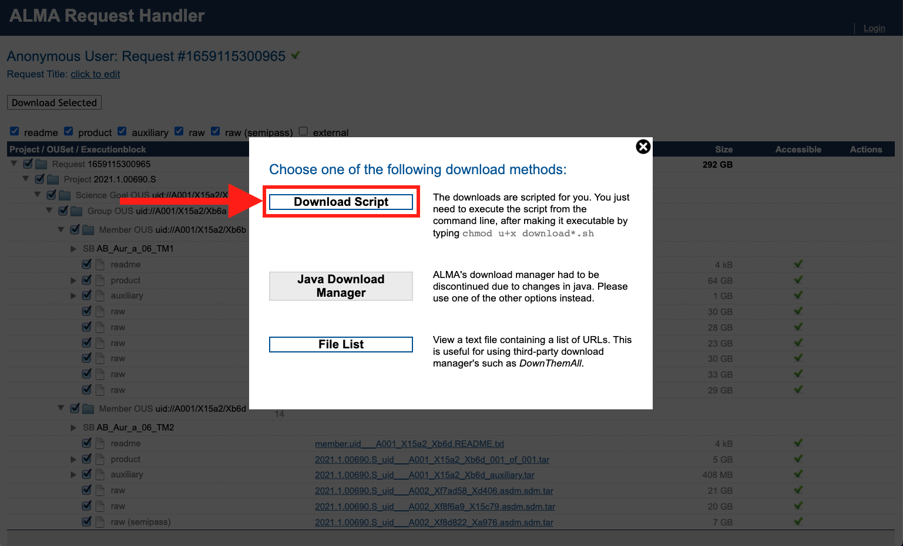
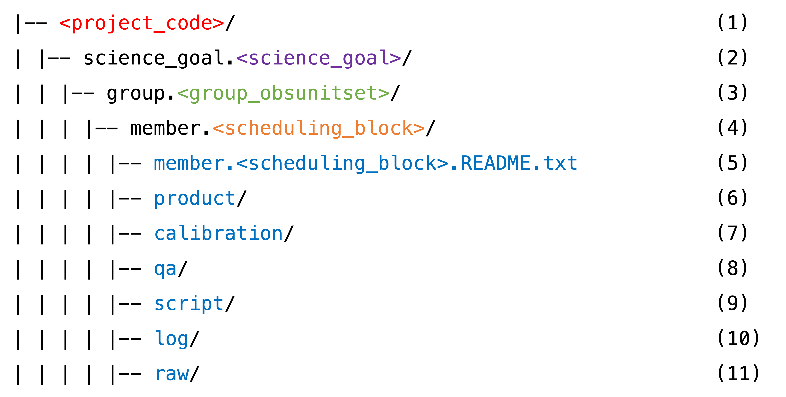
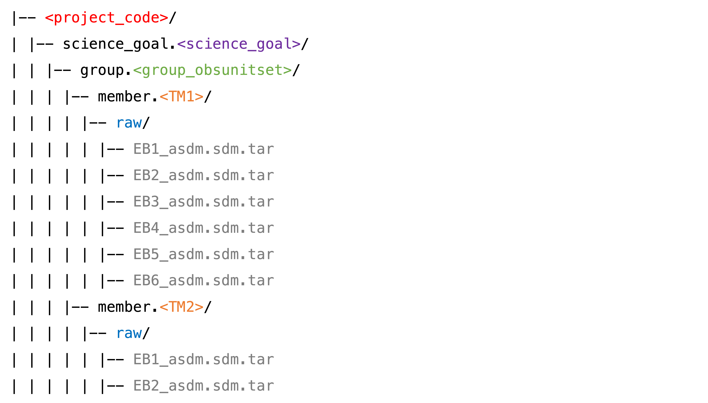

# Download the Data

1. Navigate to the <a href="https://almascience.nrao.edu/aq/" target="_blank">ALMA Archive</a> and search ``2021.1.00690.S`` in the ``Project code`` column.

````{card}

````

2. Select both scheduling blocks ("SB"s) -- TM1 (long-baseline configuration) and TM2 (short-baseline configuration). Then click ``Explore and download``.

````{card}

````

3. Personally, I (currently) prefer the legacy Request Handler. Click ``Open legacy Request Handler``.

````{card}

````

4. The legacy Request Handler is a page that looks like this:

````{card}

````

```{admonition} Understanding the data categories
:class: tip, dropdown

* \**``auxiliary``: Pipeline-generated calibration tables, scripts, logs and Quality Assurance (QA) reports.

* ``product``: Pipeline-generated image products (fits files) for the science target and calibrators (potentially incomplete).

* \**``raw``: Uncalibrated raw visibilities that the pipeline was run on.

* ``raw (semipass)``: Uncalibrated raw data that are flawed or incomplete and were not used. In our case we have one such EB in TM2.

* ``external``: Externally contributed data products (may be present in some cases).

\** These are needed for [restoring the pipeline calibration](./step0-restoring-pipeline-calibration).

```


5. The ``auxiliary`` data products will be selected by default; this contains the *calibration tables*, scripts, logs and quality assurance reports. The calibration tables are the most important output of the ALMA pipeline (they are the whole point of it, really). [Restoring the pipeline calibration](./step0-restoring-pipeline-calibration) refers to the process of applying those calibration tables back onto the raw data, so downloading the calibration tables is essential. **Make sure to also check the boxes that will give you the ``raw`` ASDMs.** The raw visibilities are delivered in the native ALMA format (the ASDM) in order to minimize the download time. Downloading these is absolutely necessary for restoring the pipeline calibration -- without them you would have no data to apply the calibration tables to. In our case, we also download the one "raw (semi-pass)" TM2 execution block, though it was not included in the pipeline calibration and we ended up not using it.

````{card}

````
6. Finally, click ``Download Selected``.

````{card}

````

7. And then select your desired download method. I go for ``Download Script``.

````{card}

````

8. Move the download script into the directory where you want ~300 GB of data to live. Make it executable:

```
chmod u+x download*.sh
```

9. And then execute it:

```
./download*.sh
```

10. Depending on the amount of data and your download speed, this could take ~a day. When it finishes, make sure to be ready to say ``yes`` to untarring *and* ``yes`` to untarring in the directory structure.

````{admonition} Understanding the directory substructure
:class: tip, dropdown

Once downloaded and untarred, all data should fall into the standardized directory structure:

```{card}

```

**(1)** The ALMA project code, or program ID. Ours is ``2021.1.00690.S``.

**(2)** The Science Goal ID. These are originally set up by the PI in the OT during proposal preparation. We have just one: ``uid___A001_X15a2_Xb69``.

**(3)** The Group ObsUnitSet (a.k.a. GOUS). In our case there is just one: ``uid___A001_X15a2_Xb6a``.

**(4)** The Member ObsUnitSet (a.k.a MOUS, a.k.a. Scheduling Block, a.k.a. SB). QA2 is carried out at this level. In our case, we have two (``uid___A001_X15a2_Xb6b`` and ``uid___A001_X15a2_Xb6d``) -- one for each array configuration. The long-baseline configuration MOUS is also referred to as TM1, and the short-baseline configuration as TM2. The pipeline is run on each MOUS separately (and thus also delivered to the PI separately).

Each of our MOUSes contain multiple execution blocks (EBs). QA0 is carried out on the EB level. All of the following directories contain all the files for each EB in each MOUS, where the file name starts with the EB ID. For example, our TM2 (short-baseline MOUS) directories contains all the files for EB1 ``uid___A002_Xf7ad58_Xd406`` and for EB2 ``uid___A002_Xf8f6a9_X15c79``.

**(5)** A very helpful file that explains the directory structure and file types.

**(6)** Contains the pipeline-generated image products (fits files).

**(7)** Contains the all-important calibration tables, and other things for restoring the pipeline calibration.

**(8)** Contains the blessing that is the Weblog. It also contains the Quality Assurance (QA) reports on the MOUS level (QA1) and the EB level (QA0).

**(9)** Contains the absolutely crucial ``scriptForPI.py`` -- what you need to restore the pipeline calibration.

**(10)** Contains the CASA commands log from the QA2 processing.

**(11)** Contains the data! The raw visibilities in the native ALMA format (the ASDM). In our case:

```{card}

```

More details can be found in <a href="https://almascience.nrao.edu/portal/documents-and-tools/cycle8/alma-qa2-data-products-for-cycle-8" target="_blank">ALMA QA2 Data Products for Cycle 8</a>, Section 3 and 4.

````
