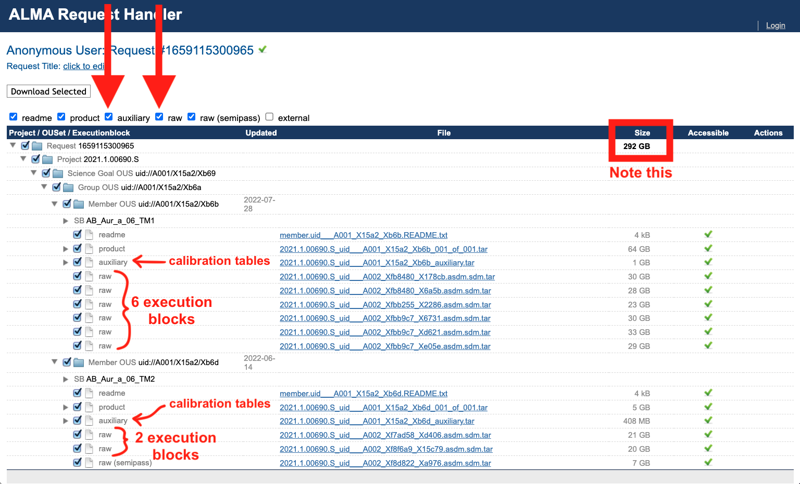

# Download the Data

1. Navigate to the <a href="https://almascience.nrao.edu/aq/" target="_blank">ALMA Archive</a> and search ``2021.1.00690.S`` in the ``Project code`` column.

````{card}

````

2. Select both scheduling blocks -- TM1 (long-baseline configuration) and TM2 (short-baseline configuration). Then click "Explore and Download".

````{card}

````

3. Personally, I (currently) prefer the legacy Request Handler.

````{card}

````

4. The legacy Request Handler is a page that looks like this:

````{card}

````

Understanding the data categories:

* auxiliary (NEED THESE FOR RESTORING PIPELINE CALIBRATION) -- calibration tables, scripts, logs and quality assurance reports

* product -- FITS products for science targets and calibrators (potentially incomplete)

* raw (NEED THESE FOR RESTORING PIPELINE CALIBRATION) -- uncalibrated raw data that were used to make the final products

* raw (semipass) (NEED THESE FOR RESTORING PIPELINE CALIBRATION - all our TM2 data is semipass) -- uncalibrated raw data that are flawed or incomplete and were not used

* external -- externally contributed data products (may be present in some cases)


5. Make sure to check the boxes that will give you the raw ASDMs. These are absolutely necessary for restoring the pipeline calibration. You don't need the raw (semi-pass); that's the abandonned SB EB 2. Then click "Download Selected":

````{card}

````


6. And then your desired download method. I go for "Download Script":

````{card}

````

7. Put the download script in the directory where you want ~300 GB of data to live. Make it executable:

```
chmod u+x download*.sh
```

8. And then execute it:

```
./download*.sh
```

9. When it finishes, make sure to say ``yes`` to untarring and ``yes`` to untarring in the directory structure.
