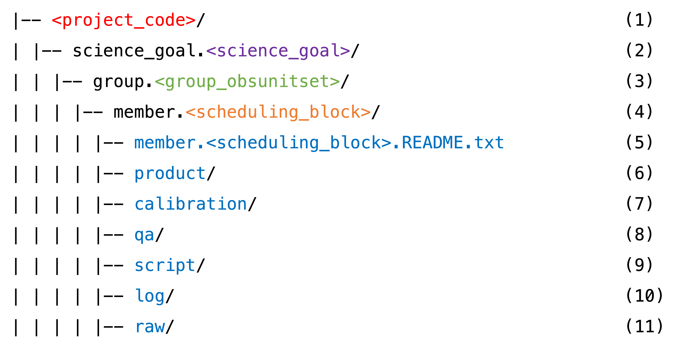

# Restoring the Pipeline Calibration

This is also known as "Generating the calibrated visibilities". (If you do a <a href="https://science.nrao.edu/facilities/alma/visitors-shortterm" target="_blank">f2f visit to the NAASC</a>, your data will be staged on NAASC computers and all of the following will be done for you before you even arrive!).

There are a couple different paths, depending on whether your program was calibrated by the pipeline or manually. See <a href="https://almascience.nrao.edu/portal/documents-and-tools/cycle8/alma-qa2-data-products-for-cycle-8" target="_blank">ALMA QA2 Data Products for Cycle 8, Section 5 (page 13)</a>. Our program was calibrated by the pipeline, so we follow **"Section 5.2: Running the `scriptForPI.py` in the case of pipeline-calibrated data"**. Section 5.4 is also helpful: "Section 5.4: Saving disk space during and after the execution of the ``scriptForPI.py``."

## Restoring the pipeline calibration using ``scriptForPI.py``

1. First, find the ``scriptForPI.py`` in the directory called ``script``. Confirm that the file ``*pprequest.xml`` is also present (it should be, it's an indicator that the program was pipeline calibrated).

````{admonition} Understanding the directory substructure
:class: tip, dropdown

Once downloaded and untarred, all data should fall into the standardized directory structure:

```{card}

```

**(1)** The ALMA project code, or program ID. Ours is ``2021.1.00690.S``.

**(2)** The Science Goal ID. These are originally set up by the PI in the OT during proposal preparation. We have just one: ``uid___A001_X15a2_Xb69``.

**(3)** The Group ObsUnitSet (a.k.a. GOUS). In our case there is just one: ``uid___A001_X15a2_Xb6a``.

**(4)** The Member ObsUnitSet (a.k.a MOUS, a.k.a. Scheduling Block, a.k.a. SB). QA2 is carried out at this level. In our case, we have two (``uid___A001_X15a2_Xb6b`` and ``uid___A001_X15a2_Xb6d``) -- one for each array configuration. The long-baseline configuration MOUS is also referred to as TM1, and the short-baseline configuration as TM2. The pipeline is run on each MOUS separately (and thus also delivered to the PI separately) -- at least as of Cycle 8!

Each of our MOUSes contain multiple execution blocks (EBs). QA0 is carried out on the EB level. All of the following directories **(6-11)** contain all the files for each EB in each MOUS, where the file name starts with the EB ID. For example, our TM2 (short-baseline MOUS) directories contain all the files for EB1 ``uid___A002_Xf7ad58_Xd406`` and for EB2 ``uid___A002_Xf8f6a9_X15c79``.

**(5)** A very helpful file that explains the directory structure and file types.

**(6)** Contains the pipeline-generated image products (fits files).

**(7)** Contains the all-important calibration tables, and other things for restoring the pipeline calibration.

**(8)** Contains the blessing that is the Weblog. It also contains the Quality Assurance (QA) reports on the MOUS level (QA1) and the EB level (QA0).

**(9)** Contains the absolutely crucial ``scriptForPI.py`` -- what you need to restore the pipeline calibration.

**(10)** Contains the CASA commands log from the QA2 processing.

**(11)** Contains the data! The raw visibilities in the native ALMA format (the ASDM). In our case:

```{card}

```

More details can be found in <a href="https://almascience.nrao.edu/portal/documents-and-tools/cycle8/alma-qa2-data-products-for-cycle-8" target="_blank">ALMA QA2 Data Products for Cycle 8</a>, Section 3 and 4.

````

2. It is important to restore the pipeline calibration using the same version of ``CASA`` as the pipeline originally did. Check your weblog or QA reports to find out. Here we use version 6.2.1.7 (appropriate for Cycle 8).

3. Open ``CASA`` in the ``script`` directory, with the pipeline functions loaded:

```console
~$ cd 2021.1.00690.S/science_goal.uid___A001_X15a2_Xb69/group.uid___A001_X15a2_Xb6a/member.uid___A001_X15a2_Xb6d/script
script$ casa --pipeline
```

4. Then, if you're ready (this could take ~a day), execute ``scriptForPI.py``:

```console
script$ execfile('member.uid___A001_X15a2_Xb6d.scriptForPI.py')
```

  Or, if you've consulted <a href="https://almascience.nrao.edu/portal/documents-and-tools/cycle8/alma-qa2-data-products-for-cycle-8" target="_blank">Section 5.4: Saving disk space during and after the execution of the scriptForPI.py</a>, set the selected flags and then execute ``scriptForPI.py``:

```console
script$ SPACESAVING=3
script$ execfile('member.uid___A001_X15a2_Xb6d.scriptForPI.py')
```

  Upon completion, a new directory should have been created (in the ``member.<scheduling_block>/`` level) called ``calibrated``, which contains a measurement set, or MS file, for each execution block. For the TM2, or short-baselines, scheduling block where we have 2 execution blocks, the contents of the ``calibrated`` folder should look like this:

```console
products -> ../calibration
rawdata
uid___A002_Xf7ad58_Xd406.ms -> working/uid___A002_Xf7ad58_Xd406.ms
uid___A002_Xf7ad58_Xd406.ms.flagversions -> working/uid___A002_Xf7ad58_Xd406.ms.flagversions
uid___A002_Xf8f6a9_X15c79.ms -> working/uid___A002_Xf8f6a9_X15c79.ms
uid___A002_Xf8f6a9_X15c79.ms.flagversions -> working/uid___A002_Xf8f6a9_X15c79.ms.flagversions
working
```

5. Repeat steps 3 and 4 for the other scheduling block, ``member.uid___A001_X15a2_Xb6b``. Upon completion, the new ``member.uid___A001_X15a2_Xb6b/calibrated`` directory should contain 6 MSes, one for each execution block.

`````{admonition} The uid*.ms measurement sets
:class: tip

These MS files contain **all original spectral windows** and **both the calibrated and uncalibrated data**. The calibrated data can be found in the MS table column ``'CORRECTED_DATA'``.
`````


## Splitting out the science spectral windows and target source

The following may or may not have been done already by ``scriptForPI.py`` (you may need to set the ``DOSPLIT`` variable to ``DOSPLIT=True``). Refer to <a href="https://almascience.nrao.edu/portal/documents-and-tools/cycle8/alma-qa2-data-products-for-cycle-8" target="_blank">Section 5.5: Splitting out the calibrated data at the end of running the scriptForPI.py</a>.

1. Split out the science spectral windows. Here again we start with the short-baseline SB.

```python
# In a CASA terminal and in the right directory: member.uid___A001_X15a2_Xb6d/calibrated/
import glob
vislist = glob.glob('*[!_t].ms')  # should be ['uid___A002_Xf7ad58_Xd406.ms', 'uid___A002_Xf8f6a9_X15c79.ms']
for myvis in vislist:
    msmd.open(myvis)
    targetspws = msmd.spwsforintent('OBSERVE_TARGET*')
    sciencespws = []
    for myspw in targetspws:
        if msmd.nchan(myspw)>4:
            sciencespws.append(myspw)
    sciencespws = ','.join(map(str,sciencespws))
    msmd.close()
    split(vis=myvis,outputvis=myvis+'.split.cal',spw=sciencespws)
```

This creates the ``uid*.ms.split.cal`` measurement sets.

`````{admonition} The uid*.ms.split.cal measurement sets
:class: tip

These MS files contain contain the **science target AND the calibrators**, but **only the science spectral windows**.
`````

2. Save the original flags.

```python
# In a CASA terminal, in e.g., member.uid___A001_X15a2_Xb6d/calibrated/
import glob
vislist=glob.glob('*.ms.split.cal')
for vis in vislist:
    flagmanager(vis=vis,
                mode='save',
                versionname='original_flags')
```

3. Split off the science target, and save those flags too.

```python
# In a CASA terminal, in e.g., member.uid___A001_X15a2_Xb6d/calibrated/
for vis in vislist:
    outputvis = vis+'.source'
    split(vis=vis,
      intent='*TARGET*', # split off the target sources by intent
      outputvis=outputvis,
      datacolumn='data')
    os.system('rm -rf ' + outputvis + '.flagversions')
    flagmanager(vis=outputvis,
                mode='save',
                versionname='original_flags')
```

This creates the ``uid*.ms.split.cal.source`` measurement sets.

`````{admonition} The uid*.ms.split.cal.source measurement sets
:class: tip

These MS files contain contain **only the science target**, and **only the science spectral windows**. The calibrated data should be in the MS table column ``'DATA'``.
`````

For the TM2, or short-baselines, scheduling block where we have 2 execution blocks, the contents of the ``calibrated`` folder should now look like this:

```
products -> ../calibration
rawdata
uid___A002_Xf7ad58_Xd406.ms -> working/uid___A002_Xf7ad58_Xd406.ms
uid___A002_Xf7ad58_Xd406.ms.flagversions -> working/uid___A002_Xf7ad58_Xd406.ms.flagversions
uid___A002_Xf7ad58_Xd406.ms.split.cal.flagversions
uid___A002_Xf7ad58_Xd406.ms.split.cal.source
uid___A002_Xf7ad58_Xd406.ms.split.cal.source.flagversions
uid___A002_Xf8f6a9_X15c79.ms -> working/uid___A002_Xf8f6a9_X15c79.ms
uid___A002_Xf8f6a9_X15c79.ms.flagversions -> working/uid___A002_Xf8f6a9_X15c79.ms.flagversions
uid___A002_Xf8f6a9_X15c79.ms.split.cal.flagversions
uid___A002_Xf8f6a9_X15c79.ms.split.cal.source
uid___A002_Xf8f6a9_X15c79.ms.split.cal.source.flagversions
working
```

4. Repeat steps 1-3 for the long-baselines scheduling block, ``member.uid___A001_X15a2_Xb6b``.

In summary, we start [step 1](../step1/step1-manual-flags.md) with 8 separate measurement sets (i.e., 8 of ``uid*.ms.split.cal.source``) which contain only the science spectral windows for only the science target.
