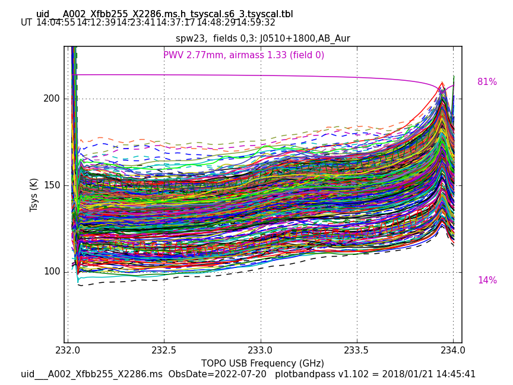
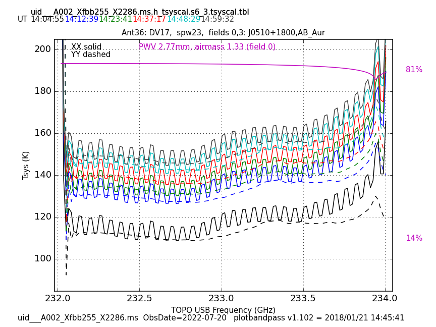
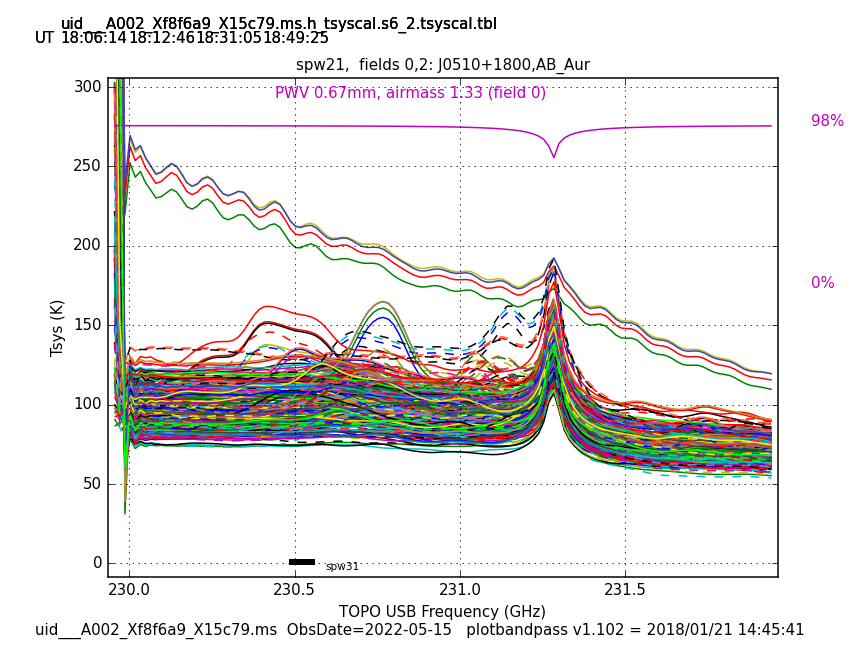
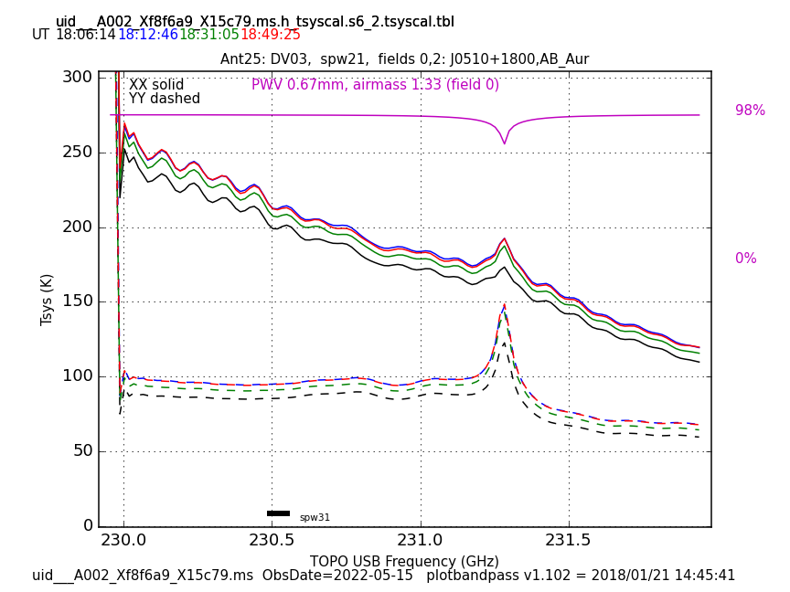

`````{admonition} Scripts for **Step 1 - Prepare the continuum**:
:class: tip
- <a href="https://github.com/jjspeedie/workflow.2021.1.0690.S/blob/main/step1_prepare_continuum.py" target="_blank">step1_prepare_continuum.py</a> # main script
- <a href="https://github.com/jjspeedie/workflow.2021.1.0690.S/blob/main/dictionary_data.py" target="_blank">dictionary_data.py</a> # loads data_dict
- <a href="https://github.com/jjspeedie/workflow.2021.1.0690.S/blob/main/step1_utils.py" target="_blank">step1_utils.py</a> # loads multiple functions
- <a href="https://github.com/jjspeedie/workflow.2021.1.0690.S/blob/main/selfcal_utils.py" target="_blank">selfcal_utils.py</a> # necessary for an initial round of selfcal at the end
`````

# Manual Flagging

We identified some flaggable issues during inspection of the weblog, namely bad antennas during the Tsys calibration in both the long-baseline and shore baseline data (see below). Flagging these data may require redoing the calibration (and the pipeline took 4 days to run on the TM1 scheduling block). However, the guidance I received is they are not too serious, that self calibration would take care of them for us. As such, we opted not to do any manual flagging.


````{card}





+++
Execution block ``uid___A002_Xfbb255_X2286.ms`` in TM1: Vampire teeth in the XX correlation of SPW 23 in the Tsys calibration. **Left:** All antennas overlaid. **Right:** Antenna DV17 isolated. The problem is not visible in the plots where all antennas are overlaid. Something like this is easy to miss if you only check the plots that overlay all antennas.

````

````{card}





+++
Execution block ``uid___A002_Xf8f6a9_X15c79.ms`` in TM2: Nearly sinusoidal Tsys in the XX correlation of SPW 21 in the Tsys calibration. **Left:** All antennas overlaid. **Right:** Antenna DV03 isolated. Some wiggles are expected (that's clouds), but perfectly sinusoidal is a bit strange.

````
