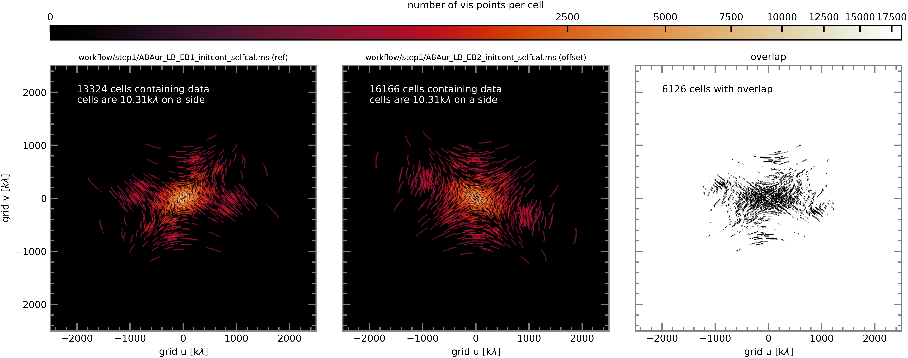
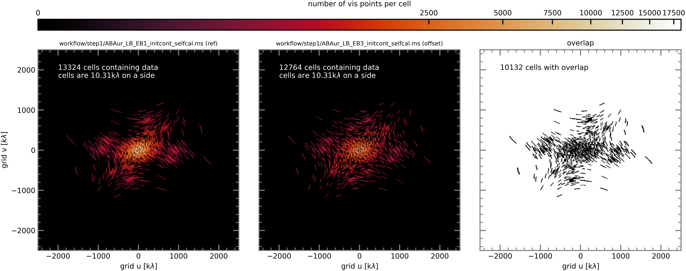
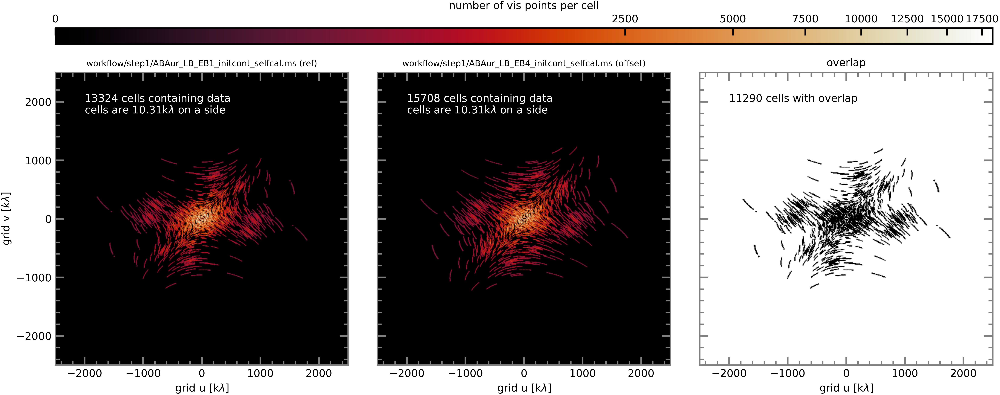
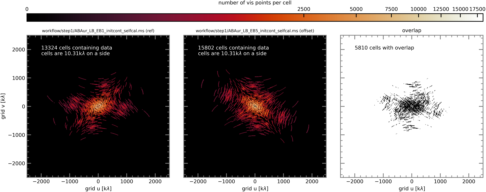

`````{admonition} Scripts for **Step 2 - Phase alignment**:
:class: tip
- <a href="https://github.com/jjspeedie/workflow.2021.1.0690.S/blob/main/step2_phase_alignment.py" target="_blank">step2_phase_alignment.py</a> # main script (using modular CASA)
- <a href="https://github.com/jjspeedie/workflow.2021.1.0690.S/blob/main/dictionary_data.py" target="_blank">dictionary_data.py</a> # loads data_dict
- <a href="https://www.exoalma.com/home" target="_blank">alignment.py</a> # exoALMA visibility alignment functions

`````
<!-- https://github.com/jjspeedie/workflow.2021.1.0690.S/blob/main/alignment.py -->

# Align Long-Baseline Execution Blocks

Here, we align five long-baseline EBs to the reference EB.

```{note}
The main script of this step, <a href="https://github.com/jjspeedie/workflow.2021.1.0690.S/blob/main/step2_phase_alignment.py" target="_blank">step2_phase_alignment.py</a>, is a modified version of the exoALMA script <a href="https://www.exoalma.com/home" target="_blank">example_alignment_usage.py</a>.
```

1. **Select the reference execution block.** Out of the 6 long-baseline execution blocks, LB EB1 has the [highest SNR](../step1/step1-initial-continuum-images.md) and the [best weather](../step0/step0-program-overview.md). We select LB EB1 to be our reference LB execution and align all other EBs to it.

```python
reference_for_LB_alignment  = ddata.data_dict['LB_EB1']['_initcont_selfcal.ms']
```

2. **Set the continuum SPW ID.** Not all spectral windows are used to compute the phase offsets.

```python
continuum_spw_id    = 0
```

3. **Set the grid.** The visibilities in each EB are gridded onto a common, regular *uv*-grid. The grid cell size in *uv*-space was chosen to correspond to ``'imsize'`` and ``'cellsize'`` values that we've used so far to make images in *xy*-space. Plots of the gridded visibilities (specifically, the number of visibility points in each cell) are generated in the next step.

```python
alignment_npix      = {'LB':2000,'SB':500}
alignment_cell_size = {'LB':0.01,'SB':0.04}
```

4. **Compute the RA and Dec offset between the ``reference_ms`` and ``align_ms``, compute the phase center shift needed to align them, and apply the shift to ``align_ms`` (all in one go).**

```python
alignment_plot_file_template = 'alignment_uv_grid.png' # this will become a suffix (for the plots)
alignment.align_measurement_sets(reference_ms       = reference_for_LB_alignment,
                                 align_ms           = offset_LB_EBs,
                                 npix               = alignment_npix['LB'],
                                 cell_size          = alignment_cell_size['LB'],
                                 spwid              = continuum_spw_id,
                                 plot_uv_grid       = True,
                                 plot_file_template = alignment_plot_file_template)
```

In the *uv* cells that contain at least 1 *uv* visibility point from <u>both</u> the reference (LB EB1) and comparison EB, the alignment code calculates the offset between their phases, taking into account the noise weights. This is done by minimizing the aggregate phase angle and amplitude difference (similar to Equation 1 of <a href="https://ui.adsabs.harvard.edu/abs/2022MNRAS.513.5790C/abstract" target="_blank">Casassus & Cárcamo 2022</a>). The entire process proceeds iteratively while sequentially shifting the comparison EB north/south and east/west, to map out a potential well. The code then returns the location of the minimum, i.e., the offset in arcseconds by which the comparison EB must be shifted in order for it to be aligned with the reference.

The following plots show the number of visibility points per cell for the reference EB and each of the comparison EBs, after the visibilities have been gridded in *uv*-space.

## LB EB2

````{card}
<center>



</center>
````

## LB EB3

````{card}
<center>



</center>
````

## LB EB4

````{card}
<center>



</center>
````

## LB EB5

````{card}
<center>



</center>
````

## LB EB6

````{card}
<center>


</center>
````

5. **Paste the results into a dictionary in preparation for checking that it worked.**

```python
alignment_offsets   = {}
#insert offsets from the alignment output
alignment_offsets['LB_EB1'] = [0,0]
alignment_offsets['LB_EB2'] = [-0.019783,0.0046808]
alignment_offsets['LB_EB3'] = [-0.012707,0.001336]
alignment_offsets['LB_EB4'] = [0.023685,-0.021869]
alignment_offsets['LB_EB5'] = [-0.020729,-0.01054]
alignment_offsets['LB_EB6'] = [-0.0045512,-0.0276]
```

6. **Check that it worked.** After aligning the EBs, we run the code again, but this time on the aligned EBs, in order to check that their offsets are small (in all cases, a fraction of a milliarcsecond).

```python
for i,shifted_ms in enumerate(shifted_LB_EBs):
    if i==0: #
        #for some reason the fitter fails when computing the offset of an EB to itself,
        #so we skip the ref EB
        continue
    offset = alignment.find_offset(reference_ms     = reference_for_LB_alignment,
                                   offset_ms        = shifted_ms,
                                   npix             = alignment_npix['LB'],
                                   cell_size        = alignment_cell_size['LB'],
                                   spwid            = continuum_spw_id)
    print(f'#offset for {shifted_ms}: ',offset)

# Results:
#offset for workflow/step2/ABAur_LB_EB2_initcont_selfcal_shift.ms:  [-0.00053475 -0.00016906]
#offset for workflow/step2/ABAur_LB_EB3_initcont_selfcal_shift.ms:  [1.71563046e-04 2.47059087e-05]
#offset for workflow/step2/ABAur_LB_EB4_initcont_selfcal_shift.ms:  [ 5.09346597e-04 -1.23296973e-05]
#offset for workflow/step2/ABAur_LB_EB5_initcont_selfcal_shift.ms:  [-7.52639036e-05 -3.63954304e-04]
#offset for workflow/step2/ABAur_LB_EB6_initcont_selfcal_shift.ms:  [ 0.00052468 -0.00087966]
```

7. **Concatenate the shifted LB EBs.** Finally we concatenate the shifted EBs into a single aligned long-baseline dataset in preparation for the next step.

```python
casatasks.concat(vis            = shifted_LB_EBs,
                 concatvis      = LB_concat_shifted,
                 dirtol         = '0.1arcsec',
                 copypointing   = False)
```

``````{dropdown} What if we hadn't done the initial round of self-cal first?
I had this question, so I also tried performing the phase alignment *before* the [initial round of self-cal](../step1/step1-initial-self-calibration.md). Here's how they compare.

Computed phase offsets prior to alignment:

`````{tab-set}

````{tab-item} With per-EB self-cal first

```python
alignment_offsets['LB_EB1'] = [0,0]
alignment_offsets['LB_EB2'] = [-0.019783,0.0046808]
alignment_offsets['LB_EB3'] = [-0.012707,0.001336]
alignment_offsets['LB_EB4'] = [0.023685,-0.021869]
alignment_offsets['LB_EB5'] = [-0.020729,-0.01054]
alignment_offsets['LB_EB6'] = [-0.0045512,-0.0276]
```

````

````{tab-item} Without per-EB self-cal first

```python
alignment_offsets['LB_EB1'] = [0,0]
alignment_offsets['LB_EB2'] = [-0.0013834,-0.0032833]
alignment_offsets['LB_EB3'] = [-0.0073534,8.5593e-05]
alignment_offsets['LB_EB4'] = [0.024526,-0.023529]
alignment_offsets['LB_EB5'] = [-0.01779,-0.0037046]
alignment_offsets['LB_EB6'] = [0.0024483,-0.03545]
```

````

`````

Computed phase offsets after alignment:

`````{tab-set}

````{tab-item} With per-EB self-cal first

```python
#offset for workflow/step2/ABAur_LB_EB2_initcont_selfcal_shift.ms:  [-0.00053475 -0.00016906]
#offset for workflow/step2/ABAur_LB_EB3_initcont_selfcal_shift.ms:  [1.71563046e-04 2.47059087e-05]
#offset for workflow/step2/ABAur_LB_EB4_initcont_selfcal_shift.ms:  [ 5.09346597e-04 -1.23296973e-05]
#offset for workflow/step2/ABAur_LB_EB5_initcont_selfcal_shift.ms:  [-7.52639036e-05 -3.63954304e-04]
#offset for workflow/step2/ABAur_LB_EB6_initcont_selfcal_shift.ms:  [ 0.00052468 -0.00087966]
```

````

````{tab-item} Without per-EB self-cal first

```python
#offset for /arc/projects/abaur/workflow/step2_noselfcal/ABAur_LB_EB1_initcont_shift.ms:  [-4.51798589e-10 -3.36817461e-09]
#offset for /arc/projects/abaur/workflow/step2_noselfcal/ABAur_LB_EB2_initcont_shift.ms:  [-1.42397170e-06 -3.31838587e-05]
#offset for /arc/projects/abaur/workflow/step2_noselfcal/ABAur_LB_EB3_initcont_shift.ms:  [-3.37030700e-05 -2.14097102e-05]
#offset for /arc/projects/abaur/workflow/step2_noselfcal/ABAur_LB_EB4_initcont_shift.ms:  [ 0.00011575 -0.0001446 ]
#offset for /arc/projects/abaur/workflow/step2_noselfcal/ABAur_LB_EB5_initcont_shift.ms:  [-4.58253229e-05  1.04505131e-04]
#offset for /arc/projects/abaur/workflow/step2_noselfcal/ABAur_LB_EB6_initcont_shift.ms:  [-0.00015515 -0.00030391]
```

````

`````

``````
