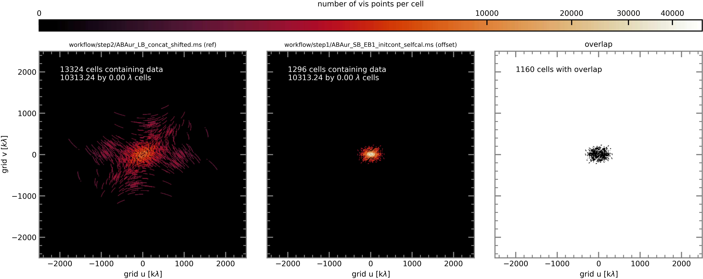

`````{admonition} Scripts for **Step 2 - Phase alignment**:
:class: tip
- <a href="https://github.com/jjspeedie/workflow.2021.1.0690.S/blob/main/step2_phase_alignment.py" target="_blank">step2_phase_alignment.py</a> # main script (using modular CASA)
- <a href="https://github.com/jjspeedie/workflow.2021.1.0690.S/blob/main/dictionary_data.py" target="_blank">dictionary_data.py</a> # loads data_dict
- <a href="https://www.exoalma.com/home" target="_blank">alignment.py</a> # exoALMA visibility alignment functions
`````
<!-- https://github.com/jjspeedie/workflow.2021.1.0690.S/blob/main/alignment.py -->


# Align Short-Baseline Execution Blocks

In order to increase the chances of overlap between the reference and comparison EBs (i.e. increase the number of grid cells containing visibility points from both MSes), we use the concatenation of all 6 LBs (obtained on the previous page) as the reference measurement set to which the SB executions are aligned.

1. **Select the reference MS.**

```python
reference_for_SB_alignment = LB_concat_shifted
```

2. **Set the continuum SPW ID.** Set on the previous page.

3. **Set the grid.** Set on the previous page.

4. **Compute the RA and Dec offset between the ``reference_ms`` and ``align_ms``, compute the phase center shift needed to align them, and apply the shift to ``align_ms`` (all in one go).**

```python
alignment.align_measurement_sets(reference_ms       = reference_for_SB_alignment,
                                 align_ms           = offset_SB_EBs,
                                 npix               = alignment_npix['SB'],
                                 cell_size          = alignment_cell_size['SB'],
                                 spwid              = continuum_spw_id,
                                 plot_uv_grid       = True,
                                 plot_file_template = alignment_plot_file_template)
```

Here again are plots of the number of visibility points per cell for the reference EB and each of the comparison EBs (which now short-baseline EBs).

## SB EB1

````{card}
<center>



</center>
````


## SB EB2

````{card}
<center>


</center>
````

5. **Paste the results into a dictionary in preparation for checking that it worked.**

```python
#insert offsets from the alignment output
alignment_offsets['SB_EB1'] = [-0.013133,0.03949]
alignment_offsets['SB_EB2'] = [0.11922,-0.19222]
```

6. **Check that it worked.**

```python
for shifted_ms in shifted_SB_EBs:
    offset = alignment.find_offset(reference_ms     = reference_for_SB_alignment,
                                   offset_ms        = shifted_ms,
                                   npix             = alignment_npix['SB'],
                                   cell_size        = alignment_cell_size['SB'],
                                   spwid            = continuum_spw_id)
    print(f'#offset for {shifted_ms}: ',offset)

# Results:
#offset for workflow/step2/ABAur_SB_EB1_initcont_selfcal_shift.ms:  [0.00011743 0.00072109]
#offset for workflow/step2/ABAur_SB_EB2_initcont_selfcal_shift.ms:  [-0.00033063 -0.00405134]
```

7. **Check in a listobs that the new phase center of each EB is that of LB1: ``04:55:45.854900 +30.33.03.73320 J2000``.**

```python
for EB in ddata.data_dict['EBs']:
    vis          = ddata.data_dict['NRAO_path']+ddata.data_dict[EB]['_initcont_selfcal_shift.ms']
    casatasks.listobs(vis=vis, listfile=vis+'.listobs.txt')
```

8. **Concatenate the shifted SB EBs.** Finally we concatenate the shifted EBs into a single aligned short-baseline dataset in preparation for [self calibration](../step3/step3-summary.md).

```python
casatasks.concat(vis            = shifted_SB_EBs,
                 concatvis      = SB_concat_shifted,
                 dirtol         = '0.1arcsec',
                 copypointing   = False)
```
