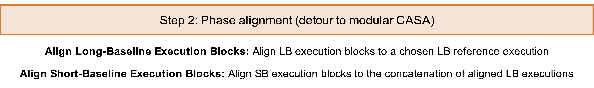

# Step 2 Overview & Scripts

In this step, we align the phase centers of all execution blocks to a common phase center, assuming the source is not variable in time.


`````{admonition} Scripts for **Step 2 - Phase alignment**:
:class: tip
- <a href="https://github.com/jjspeedie/workflow.2021.1.0690.S/blob/main/step2_phase_alignment.py" target="_blank">step2_phase_alignment.py</a> # main script (using modular CASA)
- <a href="https://github.com/jjspeedie/workflow.2021.1.0690.S/blob/main/dictionary_data.py" target="_blank">dictionary_data.py</a> # loads data_dict
- alignment.py # exoALMA visibility alignment functions (not yet public)
`````
<!-- https://github.com/jjspeedie/workflow.2021.1.0690.S/blob/main/alignment.py -->

````{card}



````


[Align Long-Baseline Execution Blocks](step2-align-LBs.md): We selected one of the long-baseline execution blocks to serve as the reference EB, to whose phase center all other EBs are aligned. The 2022-07-17 execution block (phase center: J2000 04:55:45.854900 +30.33.03.73320) was chosen as the reference EB as it was observed in the most favorable weather conditions and had the highest SNR in the initial images.
First, we aligned each of the other 5 long-baseline EBs to the reference EB. The visibilities in each EB were gridded onto a common, regular \textit{uv}-grid.
Using the \textit{uv} cells containing at least 1 \textit{uv} point from both the reference EB and the comparison EB, and taking into account the noise weights, we calculated the phase center offset between the two sets of gridded visibilities by minimizing the aggregate phase angle and amplitude difference (similar to Eqn. 1 of ref.\cite{casassus2022-pds70}).
We then used the offset to update the phase center (and coordinates) of the comparison EB to match that of the reference EB.
To check that the alignment was successful, we calculated the offset between the shifted comparison EB and the reference, and verified that the offset is small (in all cases, a fraction of a milliarcsecond). Finally we concatenated the shifted EBs into a single aligned long-baseline dataset.

[Align Short-Baseline Execution Blocks](step2-align-SBs.md): This procedure was repeated to align the two short-baseline EBs to the common phase center, this time taking the aligned concatenated long-baseline dataset as the reference in order to maximize the potential for overlap of \textit{uv} points in the common grid.
We then concatenated the shifted short-baseline EBs into a single phase-aligned short-baseline dataset.  

[Summary of Phase Shifts](step2-summary-of-shifts.md): A summary .
