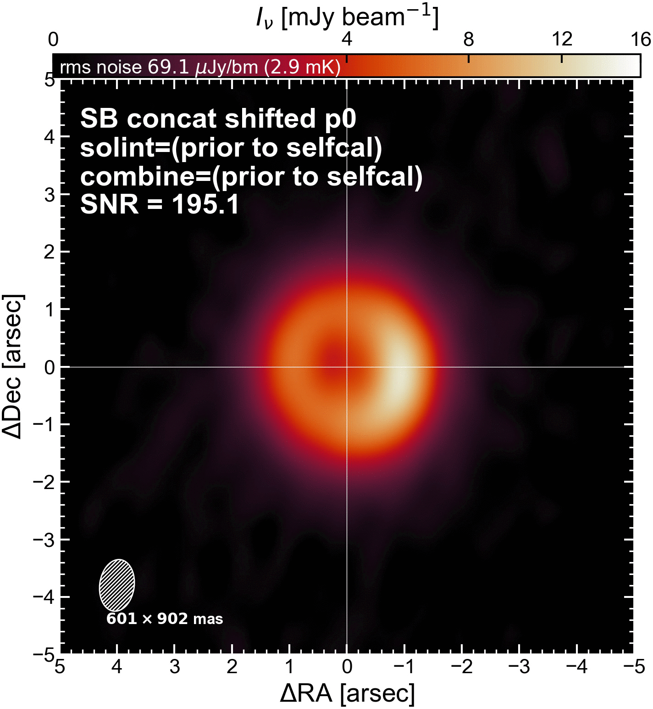

`````{admonition} Scripts for **Step 3 - Self-calibration of the continuum**:
:class: tip
- <a href="https://github.com/jjspeedie/workflow.2021.1.0690.S/blob/main/step3_continuum_selfcal.py" target="_blank">step3_continuum_selfcal.py</a> # main script
- <a href="https://github.com/jjspeedie/workflow.2021.1.0690.S/blob/main/dictionary_data.py" target="_blank">dictionary_data.py</a> # loads data_dict
- <a href="https://github.com/jjspeedie/workflow.2021.1.0690.S/blob/main/selfcal_utils.py" target="_blank">selfcal_utils.py</a> # selfcal functions
`````

# Self-Calibration of Short-Baseline Execution Blocks

Here, we self-calibrate the short-baseline continuum data (phase-aligned and concatenated).

## Summary of path through self-calibration

````{card}
<center>


</center>
+++
**Path through SB self-cal.** This table portrays the path taken through self-calibration through the choice of parameters in every round. Self-cal "starts" in the third column ("Round p0") with the ``tclean`` task, and then proceeds to the fourth column ("Round p1") with the ``gaincal`` task, and so on. We performed six rounds of phase-only self-cal ("p1", "p2", "p3" etc.), and one round of amplitude+phase self-cal ("ap"). In each round, the parameters in the ``tclean``, ``gaincal`` and ``applycal`` tasks were set as listed in that round's column. In CASA, setting a parameter to ``''`` means "all" or "nothing". Rows to look at include ``solint`` (the solution interval), ``calmode`` (phase or amplitude+phase), ``combine`` (note ``'spw'`` is not combined in Round "p1" or "p2"), and the number of failed solutions (that did not satisfy our SNR requirements). The ``threshold`` parameter for the ``tclean`` task is not set because we clean interactively.

**(selfcal_dict.txt)** The bottom few rows keep track of relevant quantities or image metrics as they change over the course of each round. Rows to look at include **SNR** (improved from 195 to 434), **disk flux** (slightly increasing until the "ap" round), and the beam major & minor axes **bmaj** & **bmin** (increasing as data associated with failed solutions is flagged out).
````

````{card}
<center>


</center>
+++
**Context for choice of ``solint``: Scan lengths within each execution block.** For example, the SB EB1 execution block contained five scans each 486 seconds long, and then a sixth scan which was 30 seconds. Thus, the ``solint`` choices of ``243s, 120s, 60s, 30s, 18s`` for the SB-only self-cal roughly correspond to half a scan, a quarter of a scan, an eighth of a scan, a sixteenth of a scan, and then 3x the record length (6s).
````


`````{dropdown} Additional explanation of parameter choices

In the ``gaincal`` task:

  * ``spw``: Setting to ``''`` selects all spectral windows. In [Step 4](../step4/step4-apply-self-cal-solutions.md) we intend to apply the self-calibration solutions we generate with the (pseudo-)continuum *onto the line data*. So even though we are only self-calibrating continuum data, it would defeat the whole purpose to not include SPWs 1-4.

  * ``solint``: The time interval on which to generate solutions. ``'inf'`` goes as wide as the boundaries specified by the ``combine`` parameter. In the first and second round (p1, p2), one solution is found per scan. Later we get down to 18 seconds (3x the record interval). In the last round we find one solution per scan again.

  * ``combine``: Dimensions of the data to combine when generating solutions. In the first two rounds, we avoid combining spectral windows (i.e., we generate per-SPW solutions) to account for any per-SPW phase offsets. Later, we have to combine spectral windows because the SNR of the solutions (in the line SPWs) is too low.

  * ``refant``: Which antenna to use as the reference antenna (in the priority listed). I selected ``DV08, DA57, DA52`` using the refant lists generated by the pipeline ``hif_refant`` task, shown in the weblog. It was a happy coincidence that the 3 highest ranked antennas in SB EB1 were the same as in SB EB2 (or was it not coincidence?). If I was more comprehensive, I would have also specified the antenna's pad, in case any were moved between executions, but the weblog did not specify the pad.

  * ``minSNR``: Minimum SNR of the solutions. If a solution has SNR below this threshold, then it (and the corresponding data) is flagged, and a statement is printed. For example:
  ````
  3 of 41 solutions flagged due to SNR < 3 in spw=10 at 2022/07/17/14:31:53.5
  7 of 36 solutions flagged due to SNR < 3 in spw=15 at 2022/07/19/12:12:23.5
  ````
  Unfortunately there's no way to access/save those printouts, so I just copy and paste them from the terminal into a script and count them up later. These printouts are one of the factors you use to decide whether to use the generated solutions. If using ``applymode='calflag'`` in ``applycal``, then you lose that flagged data. To get a sense of what *relative* amount of data did not meet the ``minSNR``, you could multiply [the total number of solution intervals found (depends on ``solint`` and number of scans)] x [the number of antennas] x [the number of spectral windows (depends on ``combine``)].

  * ``gaintype``: Could have used ``'G'``, as we only have 1 polarization mode, but DSHARP uses ``'T'``.

  * ``calmode``: Sets "phase" or "amplitude + phase" self-cal. We attempt 1 round of amplitude+phase self-cal.

  * ``scan``: Selecting all scans.

  * **num flagged solns**: See ``minSNR`` above.

In the ``applycal`` task:

  * ``spw``: Selecting all spectral windows.

  * ``applymode``: Leaving as the default (``''``), which is ``'calflag'``, meaning we apply the calibration *and* apply the flags. This is how we lose data (see ``minSNR`` above).

  * ``interp``: The kind of interpolation to use between solutions. ``'Linear'`` is the default. ``'LinearPD'`` adds an additional term into the solve that accounts for the frequency-dependence if you have a large bandwidth. Ryan says in our case it's overkill ("like using GR equations when in Newtonian regime"), but DSHARP uses it and I figured it doesn't hurt.

  * ``spwmap``: Leave this as ``''`` if combine does not include ``'spw'``. If combine does include ``'spw'``, then we need to tell ``applycal`` which SPWs of the calibration table to apply to which SPWs of the data.

In the ``tclean`` task:

  * ``imsize``: Set to go out to the primary beam HWHM (~20 arcsec). In hindsight this should be the full FOV.

  * ``cellsize``: Set to sample the beam with ~10 cells.

  * ``specmode``: Set to ``'mfs'`` to make a continuum image.

  * ``deconvolver``: Hogbom (basis of delta functions) rather than multiscale (basis of Gaussians) for disks with rings.

  * ``weighting``: Briggs, of course.

  * ``spw``: Using all SPWs to create a continuum image (we want to include the line SPWs in the model generation).

  * ``robust``: Taken to be ``0.5`` for the SB self-cal, as DSHARP did, but we increase to ``1.0`` for the SB+LB self-cal.

`````


## Achieved phase solutions as a function of time and antenna (the calibration tables)

Both SB EB1 and SB EB2 were self-calibrated together, but the following movies show plots of the solutions separately (to be able to resolve the time axis).

### SB EB1

````{card}
<center>

<video width="100%" controls>
  <source src="../_static/videos/SB_concat_shifted_EB1_cal.mp4" type="video/mp4">
</video>

</center>
+++
**Self-calibration solutions for SB EB1.** **Top row:** Gain phase, amplitude, and SNR as a function of time. Blue shaded regions denote the target scans (five scans 486 seconds long, plus a sixth 30 seconds long). **Bottom row:** Gain phase, amplitude and SNR as a function of antenna. Each frame of the movie shows a different self-cal round ("p1", "p2", "p3" etc. to "ap"). For the first two rounds, the points are coloured by spectral window (as "p1" and "p2" did not combine SPWs); in the following rounds, all SPWs are combined and points are coloured the same colour (happens to be purple). The middle column (amplitude as a function of time or antenna) does not change until the "ap" round.
````

### SB EB2

````{card}
<center>

<video width="100%" controls>
  <source src="../_static/videos/SB_concat_shifted_EB2_cal.mp4" type="video/mp4">
</video>

</center>
+++
**Self-calibration solutions for SB EB2.**
````

## Images made after each round

The following movie shows the continuum image achieved after each round of self-cal (with a large colour bar stretch to exaggerate faint emission).

````{card}
<center>

<video width="85%" controls>
  <source src="../_static/videos/SB_concat_shifted_cont.mp4" type="video/mp4">
</video>

</center>
+++
**Continuum image (SB1+SB2) achieved after each round of self-cal.** Things to notice: (1) the SNR increases; (2) the images visually improve; (3) the beam gets bigger.
````


## The results, before and after

````{card}
<center>



</center>
+++
**A gif blinking between our initial image (round "p0") and our final image (round "ap").** We achieve a decrease in rms noise by a factor of 2. The peak intensity increases by about 2 mJy/beam. The SNR improves by a factor of 2.2. The outer ring becomes more uniformly bright around its azimuth and more well-defined. The inner cavity becomes more radially extended and appears emptier.
````
