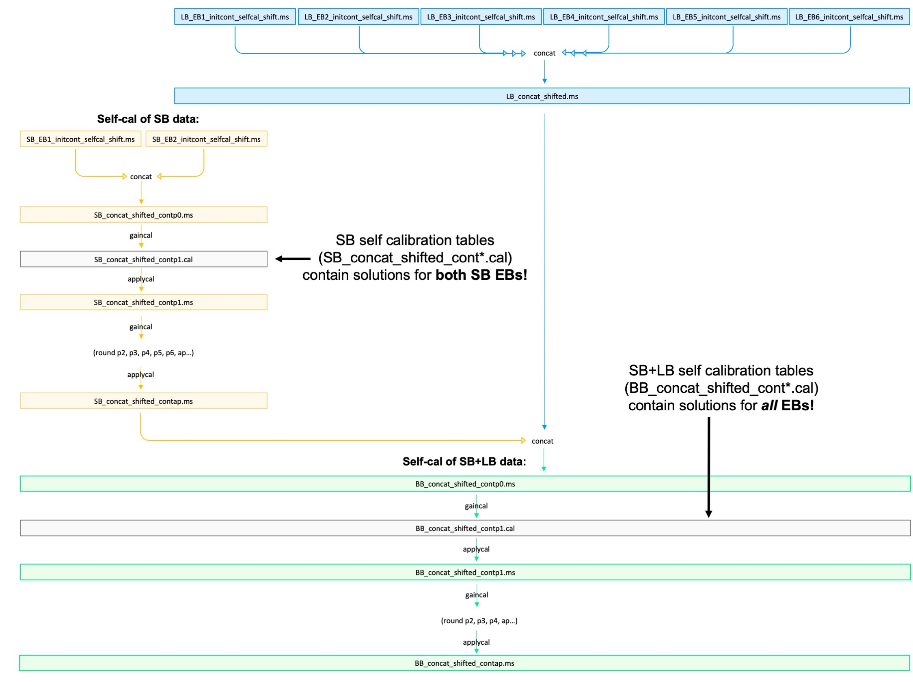
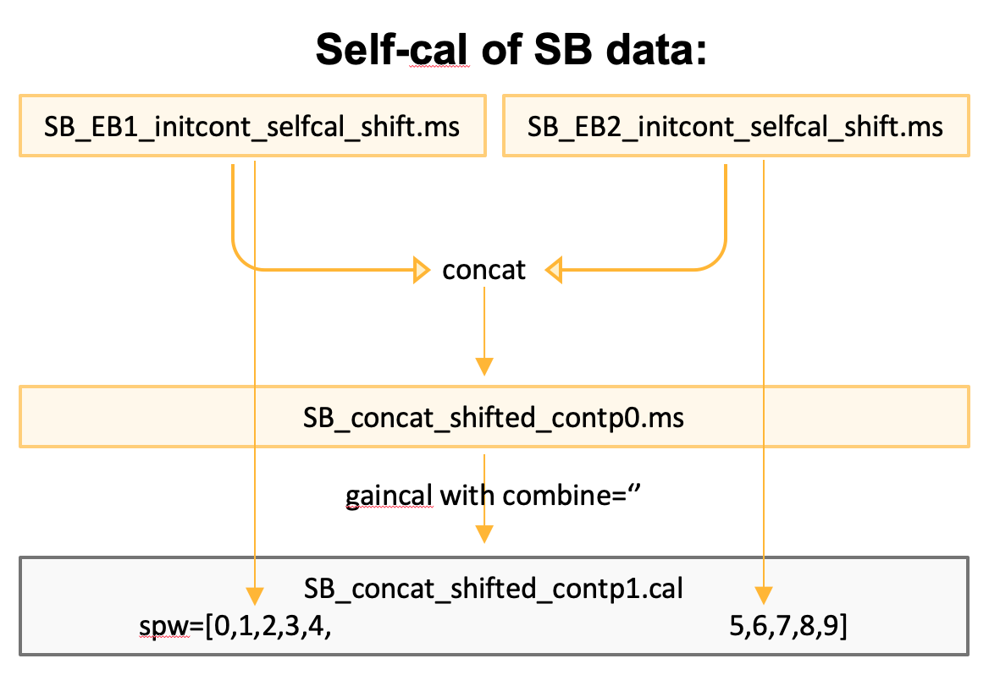
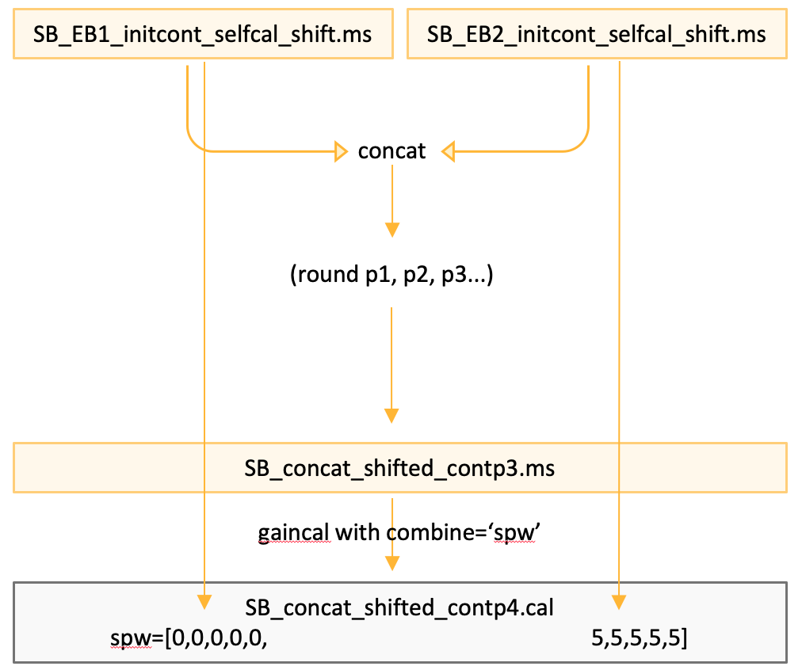
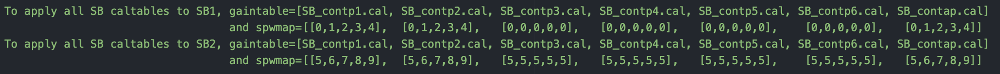
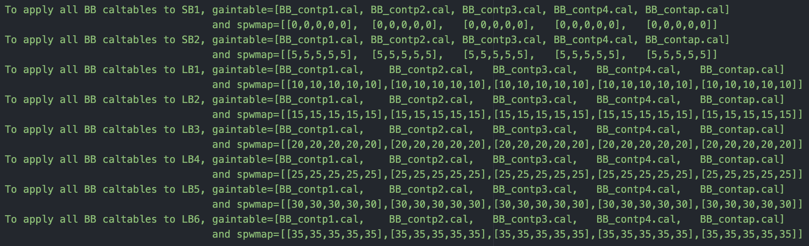

`````{admonition} Scripts for **Step 4 - Prepare the lines**:
:class: tip
- <a href="https://github.com/jjspeedie/workflow.2021.1.0690.S/blob/main/step4_prepare_lines.py" target="_blank">step4_prepare_lines.py</a> # main script
- <a href="https://github.com/jjspeedie/workflow.2021.1.0690.S/blob/main/step4_detour.py" target="_blank">step4_detour.py</a> # for phase alignment
- <a href="https://github.com/jjspeedie/workflow.2021.1.0690.S/blob/main/dictionary_data.py" target="_blank">dictionary_data.py</a> # loads data_dict
- <a href="https://github.com/jjspeedie/workflow.2021.1.0690.S/blob/main/step1_utils.py" target="_blank">step1_utils.py</a> # loads multiple functions
- <a href="https://casaguides.nrao.edu/index.php/Analysis_Utilities" target="_blank">analysisUtils (analysis_scripts/)</a> # for channel strings
`````

# Apply Self-Calibration Solutions

At this point, we have eight phase-aligned EBs (6 LBs and 2 SBs) with suffix ``_initlines_shift.ms``, containing our line data. Each EB has the four line spectral windows (SPW 1-4). The averaged-down continuum spectral window (SPW 0) is also still tagging along for the ride.

We now wish to *apply* the calibration solutions that we generated from the continuum self-calibration in [Step 3](../step3/step3-summary.md). The calibration solutions are in calibration tables. Each one contains information that the others do not, so we need to apply them all, and in the same succession as they were generated.

````{card}
|   Calibration tables generated using [short-baseline data only](../step3/step3-selfcal-SBs.md)     | Calibration tables generated using [concatenated short-baseline + long-baseline data](../step3/step3-selfcal-SBs+LBs.md)   |
|--------------------|-----------------|
|     SB_contp1.cal  |  BB_contp1.cal  |
|     SB_contp2.cal  |  BB_contp2.cal  |
|     SB_contp3.cal  |  BB_contp3.cal  |
|  SB_contp4.cal     |  BB_contp4.cal  |
|     SB_contp5.cal  |  BB_contap.cal  |
|   SB_contp6.cal    |                 |
|   SB_contap.cal    |                 |
+++
**Left column:** The calibration tables we generated from the [short-baseline data only](../step3/step3-selfcal-SBs.md). **Right column:** The calibration tables we generated from the [concatenated short-baseline + long-baseline data](../step3/step3-selfcal-SBs+LBs.md) ("BB" stands for "both baselines").
````

It would be most intuitive to concatenate the SB line data (i.e., concatenate the two short baseline ``_initlines_shift.ms`` measurement sets), and then apply each of the calibration tables in the left column above (``SB_contp1.cal``, then ``SB_contp2.cal``, and so on) -- *and then* concatenate that resulting SB data with the LB data (i.e., the six long baseline ``_initlines_shift.ms`` measurement sets), and apply the self calibration tables in the right column above (``BB_contp1.cal``, then ``BB_contp2.cal``, and so on) to that single giant measurement set. However, concatenating would use *a lot* of disk space (each MS is ~50 GB), and it would take ``applycal`` a lot of time to apply the solutions. As such, we keep the data in their separate execution blocks, and then at [the very end](../step4/step4-line-mses-achieved.md), split out each spectral window and combine the corresponding spectral windows across executions.

Doing it this way, we face one complication: We generated our self calibration tables using concatenated data. This means that each calibration table is big, and contains solutions for multiple EBs. We need to apply each calibration table to only a subset of the data it was generated with. Below is a visual representation of the situation.

````{card}
<center>



</center>
+++
We want a way to reference only a certain portion of each calibration table in order to apply that portion to each corresponding EB separately.
````

The ``applycal`` task ``spwmap`` parameter lets us take only a subset of the *spectral windows* contained within a calibration table, and apply those to the input MS. The trick is knowing how the mapping will work, because it requires accounting for the rounds where ``combine='spw'`` parameter was or wasn't set during ``gaincal``. For example, compare these two SB calibration tables:

````{card}





+++
**Left:** Spectral windows were <u>not</u> combined (``combine=''``). **Right:** Spectral windows <u>were</u> combined (``combine='spw'``). In both cases, notice the spectral window indexing in the calibration tables (grey boxes), and where it comes from.
````

The same idea applies for the BB (SB+LB) calibration tables. Here is the same information but presented a different way:

```console
SB_contp1.cal was gained on SB1 and SB2 with combine='', so it contains spws [0,1,2,3,4,5,6,7,8,9]
If we want to apply it to SB 1 (lines) only, we need spwmap=[0,1,2,3,4]
                   and to SB 2 (lines) only, we need spwmap=[5,6,7,8,9]

SB_contp3.cal was gained on SB1 and SB2 with combine=spw, so it contains spws [0,0,0,0,0,5,5,5,5,5]
If we want to apply it to SB 1 (lines) only, we need spwmap=[0,0,0,0,0]
                   and to SB 2 (lines) only, we need spwmap=[5,5,5,5,5]
```

The ``applycal`` task has another very useful parameter, ``gaintable``, which we use to apply multiple calibration solutions in one call, but still in succession.

So with all that in mind, these are the required lists and combinations:

````{card}
<center>



</center>
+++
Combination of ``gaintable`` and ``spwmap`` parameters to be used in the ``applycal task`` for self calibration of each of the SB line measurement sets.
````

<!-- ```{figure} images/step4_difficulty_workflow_SB.png
:alt: applying-calibration-tables
:class: mb-1
:width: 100%
:align: center
Combination of gaintable and spwmap parameters to be used in the applycal task for self calibration of each of the SB line measurement sets.
``` -->

````{card}
<center>



</center>
+++
Combination of ``gaintable`` and ``spwmap`` parameters to be used in the ``applycal`` task for self calibration of each of the SB+LB line measurement sets.
````

<!-- ```{figure} images/step4_difficulty_workflow_BB.png
:alt: applying-calibration-tables
:class: mb-1
:width: 100%
:align: center
Combination of gaintable and spwmap parameters to be used in the applycal task for self calibration of each of the SB and LB line measurement sets.
``` -->

We do two "runs" of ``applycal``; the first to apply the SB calibration tables, and the second to apply the SB+LB calibration tables. These are done separately (we do not feed in an uber ``gaintable`` and ``spwmap`` list) so that the ``applymode`` parameter can be set differently in the two cases. In the former, ``applymode='calflag'`` (calibrate and flag), and in the latter, ``applymode = 'calonly'`` (calibrate only).
