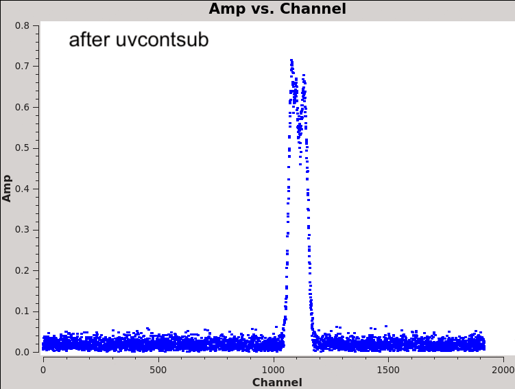
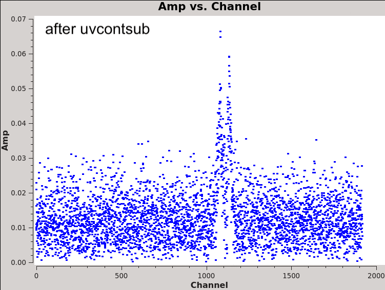

`````{admonition} Scripts for **Step 4 - Prepare the lines**:
:class: tip
- <a href="https://github.com/jjspeedie/workflow.2021.1.0690.S/blob/main/step4_prepare_lines.py" target="_blank">step4_prepare_lines.py</a> # main script
- <a href="https://github.com/jjspeedie/workflow.2021.1.0690.S/blob/main/step4_detour.py" target="_blank">step4_detour.py</a> # for phase alignment
- <a href="https://github.com/jjspeedie/workflow.2021.1.0690.S/blob/main/dictionary_data.py" target="_blank">dictionary_data.py</a> # loads data_dict
- <a href="https://github.com/jjspeedie/workflow.2021.1.0690.S/blob/main/step1_utils.py" target="_blank">step1_utils.py</a> # loads multiple functions
- <a href="https://casaguides.nrao.edu/index.php/Analysis_Utilities" target="_blank">analysisUtils (analysis_scripts/)</a> # for channel strings
`````

# Continuum Subtraction

Performed in uv-space with CASA task uvcontsub. Here is the before-and-after, for SB EB 1, for spectral windows SO, C18O, 13CO, 12CO (left to right):

````{card} Continuum subtraction: SB EB 1





+++
Amplitude vs. channel, before and after continuum subtraction. Channels used to fit the continuum are the inverse of those used to flag the spectral lines in Step 1. Showing SB EB1. Notice in the case of the SO spectral window (left), the y-axis values change (0.06 to 0.04).
````

The results for the other EBs are similar, although none that look as clear as SB EB1. Here for example is LB EB5:

````{card} Continuum subtraction: LB EB 5





+++
I'm a bit concerned about the 13CO spectral window here (2nd from right). Notice the y-axis changes from 0.6 to 0.07. The amplitude of the line significantly decreases. This could just be an averaging trick (these plots were made with avgtime='1e8', avgscan=True and avgbaseline=True), but I'm not sure. Before uvcontsub, the line doesn't look "empty". What can I do about this?
````


For the record, here are the spectral windows used to fit the continuum ("fitspw"):

```
Flagchannels input string for SB_EB1: '1:517~589,       2:504~600,       3:961~1251,        4:556~1059'
                              fitspw:  1:0~516;590~959, 2:0~503;601~959, 3:0~960;1252~1919, 4:0~555;1060~1919
Flagchannels input string for SB_EB2: '1:517~589,       2:504~600,       3:962~1251,        4:554~1058'
                              fitspw:  1:0~516;590~959, 2:0~503;601~959, 3:0~961;1252~1919, 4:0~553;1059~1919
Flagchannels input string for LB_EB1: '1:516~589,       2:504~600,       3:960~1249,        4:553~1057'
                              fitspw:  1:0~515;590~959, 2:0~503;601~959, 3:0~959;1250~1919, 4:0~552;1058~1919
Flagchannels input string for LB_EB2: '1:517~589,       2:504~600,       3:960~1249,        4:553~1057'
                              fitspw:  1:0~516;590~959, 2:0~503;601~959, 3:0~959;1250~1919, 4:0~552;1058~1919
Flagchannels input string for LB_EB3: '1:517~589,       2:505~601,       3:960~1249,        4:553~1057'
                              fitspw:  1:0~516;590~959, 2:0~504;602~959, 3:0~959;1250~1919, 4:0~552;1058~1919
Flagchannels input string for LB_EB4: '1:516~589,       2:504~600,       3:960~1249,        4:553~1057'
                              fitspw:  1:0~515;590~959, 2:0~503;601~959, 3:0~959;1250~1919, 4:0~552;1058~1919
Flagchannels input string for LB_EB5: '1:516~588,       2:504~600,       3:960~1250,        4:553~1057'
                              fitspw:  1:0~515;589~959, 2:0~503;601~959, 3:0~959;1251~1919, 4:0~552;1058~1919
Flagchannels input string for LB_EB6: '1:517~589,       2:505~601,       3:960~1249,        4:553~1057'
                              fitspw:  1:0~516;590~959, 2:0~504;602~959, 3:0~959;1250~1919, 4:0~552;1058~1919
```

## Velocity re-gridding

What I didn't realize beforehand is that cvel2 cannot regrid a measurement set that contains multiple spectral windows all at the same time. So I split each spectral window out of each execution block (both the continuum subtracted and non-continuum subtracted versions), and regridded them individually.

A listobs nicely shows that they've been successfully regridded. Here for example is the LB EB1 spectral window for SO, before and after the cvel2 task. Notice "Frame" changes from TOPO to LSRK:

```
Spectral Windows:  (1 unique spectral windows and 1 unique polarization setups)
  SpwID  Name                                       #Chans   Frame   Ch0(MHz)  ChanWid(kHz)  TotBW(kHz) CtrFreq(MHz) BBC Num  Corrs
  0      X2090867609#ALMA_RB_06#BB_1#SW-01#FULL_RES    960   TOPO  219985.475       -61.035     58593.8 219956.2084        1  XX  YY
```

```
Spectral Windows:  (1 unique spectral windows and 1 unique polarization setups)
  SpwID  Name                                       #Chans   Frame   Ch0(MHz)  ChanWid(kHz)  TotBW(kHz) CtrFreq(MHz) BBC Num  Corrs
  0      X2090867609#ALMA_RB_06#BB_1#SW-01#FULL_RES    960   LSRK  219978.920       -61.033     58592.0 219949.6544        1  XX  YY
```

Looking at the channel frequencies in each execution block and each spectral window, before and after regridding:

````{card}


````

##

```{dropdown} Re-investigating the effect of cvel2 velocity regridding
I was interested to know whether cvel2 had aligned the channel frequencies perfectly (or at least, to within a channel width). For example, here's the Spectral Window section of the listobs output for ABAur_SO.bin30s.ms.cvel2:


Spectral Windows:  (8 unique spectral windows and 1 unique polarization setups)
  SpwID  Name                                       #Chans   Frame   Ch0(MHz)  ChanWid(kHz)  TotBW(kHz) CtrFreq(MHz) BBC Num  Corrs
  0      X392063246#ALMA_RB_06#BB_1#SW-01#FULL_RES     960   LSRK  219978.952       -61.041     58599.8 219949.6829        1  XX  YY
  1      X392063246#ALMA_RB_06#BB_1#SW-01#FULL_RES     960   LSRK  219978.944       -61.039     58597.7 219949.6754        1  XX  YY
  2      X2090867609#ALMA_RB_06#BB_1#SW-01#FULL_RES    960   LSRK  219978.920       -61.033     58592.0 219949.6544        1  XX  YY
  3      X2090867609#ALMA_RB_06#BB_1#SW-01#FULL_RES    960   LSRK  219978.925       -61.033     58591.8 219949.6595        1  XX  YY
  4      X2090867609#ALMA_RB_06#BB_1#SW-01#FULL_RES    960   LSRK  219978.934       -61.033     58591.8 219949.6688        1  XX  YY
  5      X2090867609#ALMA_RB_06#BB_1#SW-01#FULL_RES    960   LSRK  219978.918       -61.033     58591.7 219949.6531        1  XX  YY
  6      X2090867609#ALMA_RB_06#BB_1#SW-01#FULL_RES    960   LSRK  219978.909       -61.033     58591.6 219949.6434        1  XX  YY
  7      X2090867609#ALMA_RB_06#BB_1#SW-01#FULL_RES    960   LSRK  219978.936       -61.033     58591.6 219949.6707        1  XX  YY


Looking at the frequency of the first channel (column Ch0), I see that the difference between Ch0 of SB EB1 (first row) and Ch0 of the other EBs is: -8 kHz, -32 kHz, -27 kHz, -18 kHz, -34 kHz, -43 kHz, and -16 kHz. So I guess you could say they are all aligned to within a channel width (61 kHz).
Doing the same exercise for the ABAur_13CO.bin30s.ms.cvel2:

SpwID  Name                                       #Chans   Frame   Ch0(MHz)  ChanWid(kHz)  TotBW(kHz) CtrFreq(MHz) BBC Num  Corrs
  0      X392063246#ALMA_RB_06#BB_2#SW-01#FULL_RES    1920   LSRK  220428.185       -30.521     58599.8 220398.9008        2  XX  YY
  1      X392063246#ALMA_RB_06#BB_2#SW-01#FULL_RES    1920   LSRK  220428.186       -30.520     58597.7 220398.9022        2  XX  YY
  2      X2090867609#ALMA_RB_06#BB_2#SW-01#FULL_RES   1920   LSRK  220428.133       -30.517     58592.0 220398.8520        2  XX  YY
  3      X2090867609#ALMA_RB_06#BB_2#SW-01#FULL_RES   1920   LSRK  220428.136       -30.517     58591.8 220398.8557        2  XX  YY
  4      X2090867609#ALMA_RB_06#BB_2#SW-01#FULL_RES   1920   LSRK  220428.145       -30.517     58591.8 220398.8647        2  XX  YY
  5      X2090867609#ALMA_RB_06#BB_2#SW-01#FULL_RES   1920   LSRK  220428.129       -30.517     58591.7 220398.8485        2  XX  YY
  6      X2090867609#ALMA_RB_06#BB_2#SW-01#FULL_RES   1920   LSRK  220428.149       -30.516     58591.6 220398.8684        2  XX  YY
  7      X2090867609#ALMA_RB_06#BB_2#SW-01#FULL_RES   1920   LSRK  220428.146       -30.516     58591.6 220398.8654        2  XX  YY

The difference in Ch0 between EBs is: 1 kHz, -52 kHz, -49 kHz, -40 kHz, -56 kHz, -36 kHz, and -39 kHz. All but one of these differences are larger than the channel width (30 kHz). Is this concerning?
```
