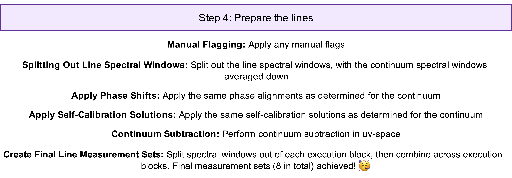

# Step 4 Overview & Scripts

In this step, we finally work with the line data to prepare them for imaging. We apply all phase alignment and self-calibration solutions generated from the continuum, and perform continuum subtraction.

`````{admonition} Scripts for **Step 4 - Prepare the lines**:
:class: tip
- <a href="https://github.com/jjspeedie/workflow.2021.1.0690.S/blob/main/step4_prepare_lines.py" target="_blank">step4_prepare_lines.py</a> # main script
- <a href="https://github.com/jjspeedie/workflow.2021.1.0690.S/blob/main/step4_detour.py" target="_blank">step4_detour.py</a> # for phase alignment
- <a href="https://github.com/jjspeedie/workflow.2021.1.0690.S/blob/main/dictionary_data.py" target="_blank">dictionary_data.py</a> # loads data_dict
- <a href="https://github.com/jjspeedie/workflow.2021.1.0690.S/blob/main/step1_utils.py" target="_blank">step1_utils.py</a> # loads multiple functions
- <a href="https://casaguides.nrao.edu/index.php/Analysis_Utilities" target="_blank">analysisUtils (analysis_scripts/)</a> # for channel strings
`````

````{card}



````

[Manual Flagging](step4-manual-flags.md): Like for the continuum, we do no manual flagging.

[Splitting Out Line Spectral Windows](step4-split-spws.md): Having gained what we need from the continuum self-calibration,
we returned to the non-spectrally averaged pipeline calibrated visibilities to split out the line SPWs and spectrally average down the continuum.
<!-- %[Details: We spectrally averaged the continuum SPWs into a single channel; purely for the sake of minimizing the size; it will be left behind soon enough]. -->

[Apply Phase Shifts](step4-apply-phase-alignments.md): On a per-EB basis, we applied the same phase center realignments and calibration gain tables that we generated with the continuum data.

[Apply Self-Calibration Solutions](step4-apply-self-cal-solutions.md): On a per-EB basis, we applied the same phase center realignments and calibration gain tables that we generated with the continuum data.

[Continuum Subtraction](step4-continuum-subtraction.md): We performed continuum subtraction in the *uv*-plane using the ``uvcontsub`` task.

[Create Final Line Measurement Sets](step4-line-mses-achieved.md): Finally, we combined the corresponding SPWs across execution blocks and obtained final measurement sets ready for imaging. (Note: We do not regrid the measurement sets onto a common velocity grid using the ``cvel2`` task; we let ``tclean`` do this during imaging so as not to bin already-binned data.
